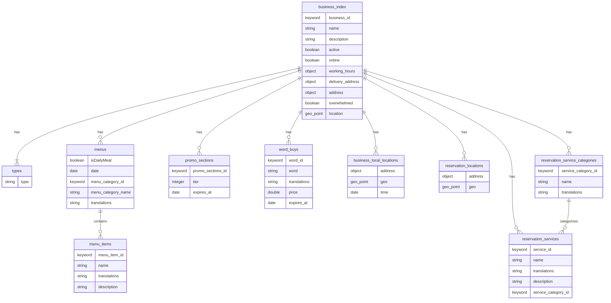
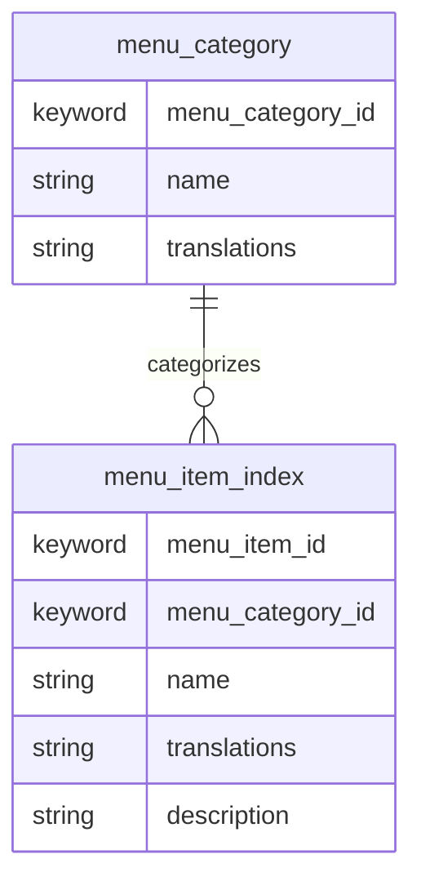
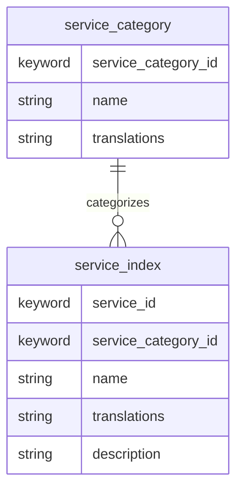

# Elasticsearch in klikni-be

Elasticsearch is a distributed search and analytics engine designed for fast, full‑text search, faceting, aggregations, and geo queries. It stores documents in schema‑flexible indexes and lets you query across text, numbers, dates, and geospatial data with relevance scoring.

## Usage

- Index name: `business_index`
- One document per business. This document consolidates:
    - Core business info (name, description, status/flags, location)
    - Merchant module content (menus, categories, menu items)
    - Promo context (promo sections, word buys)
    - Local ordering windows (business_local_locations)
    - Reservation module content (locations and services)
- Indexer: `elasticsearch/indexes/businessIndex.js`
    - Creates/updates the index with mappings
    - Reads data from Postgres via Prisma and upserts documents with `_id = business_id`
- Search: `elasticsearch/searches/fullSearch.js`
    - Full‑text matching on name/description, nested menu item names/descriptions, and word buys
    - Geo filtering and distance‑based scoring using document `location`
    - Optional filters (categories via nested menus, promo sections, business type)
    - SPECIAL handling for LOCAL businesses: only show if a future local window exists in `business_local_locations`

---

## business_index

## menu_item_index

Purpose

- A lean index optimized for menu item search.

Document shape

- One document per current menu item version

## service_index

Purpose

- Fast search for reservation services by name/description.

Document shape

- One document per service

