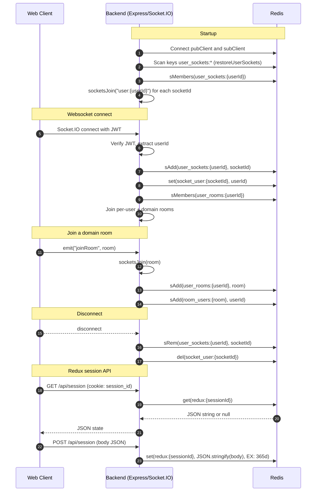

# Redis

This document explains how Redis is used in this project: the libraries, connection setup, keyspace conventions, and the main interaction flows between the backend and Redis.

## Summary

Redis is used for two primary purposes:

- Socket.IO clustering and presence state via the Redis adapter
    - Pub/Sub for cross-node event propagation
    - Presence and room membership indices stored in Redis Sets and Strings
- Session-like storage for the web client's Redux state
    - JSON payloads stored under per-session keys with long TTLs

## Libraries and versions

- node-redis v4: `redis@^4.7.x`
- Socket.IO Redis adapter: `@socket.io/redis-adapter@^8.3.x`

Key reference files:

- `lib/redis.js`: single Redis client factory and configuration
- `socket.js`: Socket.IO server, Redis adapter, and Redis-backed presence indices
- `routes/api/session.routes.ts`: GET/POST endpoints that read/write Redux state to Redis

## Connection and configuration

- Client initialization: `lib/redis.js`
    - Constructs Redis URL from environment:
        - `REDIS_HOST` (default `localhost`)
        - `REDIS_PORT` (default `6379`)
        - `REDIS_PASSWORD` (optional)
    - Example URL forms:
        - Without password: `redis://<host>:<port>`
        - With password: `redis://:<password>@<host>:<port>`
    - Errors are logged via the client's `error` event.
- Socket adapter: `socket.js`
    - Uses the shared client for publishing and a `.duplicate()` client for subscription.
    - Connects both before attaching the adapter: `createAdapter(pubClient, subClient)`.
- Docker support:
    - A Redis service is defined in `Docker/redis/docker-compose.redis.partial.yml`.
    - Password is enforced via generated `redis.conf` from `REDIS_PASSWORD`.
    - When running in Docker Compose, make sure the app can reach the `redis` host on the shared network or set `REDIS_HOST=redis` in the app environment.

Note: There is a `REDIS_URL` in `.env` used for tooling and documentation. The current runtime client (`lib/redis.js`) reads host/port/password separately and does not consume `REDIS_URL` directly.

## Keyspace conventions

Presence and room membership indices (managed in `socket.js`):

- `user_sockets:{userId}` → Set of Socket.IO `socket.id` values
- `socket_user:{socketId}` → String value of `userId`
- `user_rooms:{userId}` → Set of domain room names the user should auto-rejoin
- `room_users:{roomName}` → Set of `userId` values currently in that room

Session state (managed in `routes/api/session.routes.ts`):

- `redux:{sessionId}` → JSON serialized Redux state
    - TTL: 365 days (set via `EX` option in `redis.set`)

## Lifecycle and flows

Socket.IO + Redis (file: `socket.js`):

- Startup
    - Create adapter with pub/sub clients, then call `restoreUserSockets()` to rebuild per-user rooms by scanning `user_sockets:*` and joining each socket id to its per-user room.
- Connect
    - Authenticate with JWT; derive `userId`.
    - Index the connection:
        - Add socket id to `user_sockets:{userId}` (SADD)
        - Set `socket_user:{socketId}` = `userId` (SET)
    - Ensure the socket joins the per-user room `user:{userId}`.
    - Re-join any domain rooms from `user_rooms:{userId}`.
- Join/Leave domain rooms
    - `addUserToRoom(userId, room)`:
        - Socket.IO `socketsJoin(room)` (cluster-wide)
        - `SADD user_rooms:{userId} room`
        - `SADD room_users:{room} userId`
    - `removeUserFromRoom(userId, room)`:
        - Socket.IO `socketsLeave(room)`
        - `SREM user_rooms:{userId} room`
        - `SREM room_users:{room} userId`
- Disconnect
    - Remove indices:
        - `SREM user_sockets:{userId} socketId`
        - `DEL socket_user:{socketId}`
    - Socket.IO clears room membership automatically for the socket.

Session Redux state (file: `routes/api/session.routes.ts`):

- GET `/api/session`
    - Reads `session_id` from cookie.
    - `GET redux:{sessionId}` and `JSON.parse` fallback to `{}`.
- POST `/api/session`
    - Writes the JSON body to `redux:{sessionId}` with `EX: 365 * 24 * 60 * 60` seconds.

## Interaction diagram

## Operational notes and caveats

- Redis availability
    - Socket.IO adapter requires an active connection to propagate events across nodes. If Redis is down, multi-node broadcasting will fail and adapter attach will throw until Redis is reachable.
- `restoreUserSockets()`
    - Uses `KEYS user_sockets:*`. On very large keyspaces, consider using `SCAN` in batches to avoid blocking.
- Data retention
    - Redux session keys have long TTL; if they contain sensitive data, reconsider TTL or scope.
- Key hygiene
    - All keys are namespaced with clear prefixes; avoid collisions by reusing these prefixes for related features.

## Quick reference

- Code
    - Redis client: `lib/redis.js`
    - Socket/adapter/state: `socket.js`
    - Session API: `routes/api/session.routes.ts`
- Environment
    - `REDIS_HOST`, `REDIS_PORT`, `REDIS_PASSWORD` (used by runtime)
    - `REDIS_PASSWORD` (Docker Redis password)
    - Optional `REDIS_HOST=redis` when running via Docker networks
- Docker
    - Service file: `Docker/redis/docker-compose.redis.partial.yml`
    - Config template: `Docker/redis/redis.template.conf` (enforces `requirepass`)
