# Database ERD

> Generated by [`prisma-markdown`](https://github.com/samchon/prisma-markdown)

- [Business](#business)
- [BusinessUsers](#businessusers)
- [Cashback](#cashback)
- [Referral](#referral)
- [FamilyUsers](#familyusers)
- [Documents](#documents)
- [Files](#files)
- [Users](#users)
- [Addresses](#addresses)
- [Payments](#payments)
- [LostItems](#lostitems)
- [Wallet](#wallet)
- [PromoSections](#promosections)
- [PromoAds](#promoads)
- [PromoWords](#promowords)
- [Promo](#promo)
- [Drivers](#drivers)
- [Blog](#blog)
- [Regions](#regions)
- [CRM](#crm)
- [Stores](#stores)
- [FoodDrinks](#fooddrinks)
- [DeliveryOrders](#deliveryorders)
- [DailyMeals](#dailymeals)
- [Menus](#menus)
- [MenuItems](#menuitems)
- [TableReservations](#tablereservations)
- [OrderLobbies](#orderlobbies)
- [Invoices](#invoices)
- [Reservations](#reservations)
- [Subscriptions](#subscriptions)
- [Transport](#transport)
- [TaxiOrders](#taxiorders)
- [Vehicles](#vehicles)
- [Services](#services)
- [Schedules](#schedules)
- [Courses](#courses)
- [Bookings](#bookings)
- [Notifications](#notifications)
- [Delivery](#delivery)

## Business

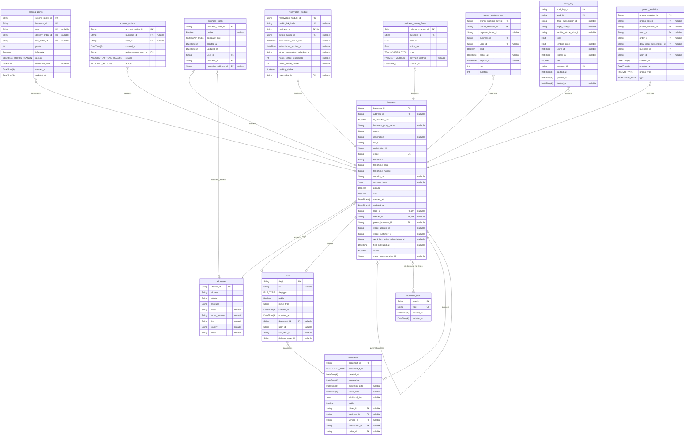

### `business`

Business entity representing a merchant/partner account or crm.

Core company profile linked to address, documents, analytics, roles and users.

Properties as follows:

- `business_id`:
- `address_id`:
- `is_business_unit`:
- `business_group_name`:
- `name`:
- `description`:
- `tax_id`:
- `registration_id`:
- `email`:
- `telephone`:
- `telephone_code`:
- `telephone_number`:
- `website_url`:
- `working_hours`:
- `popular`:
- `new`:
- `created_at`:
- `updated_at`:
- `logo_id`:
- `banner_id`:
- `parent_business_id`:
- `stripe_account_id`:
- `stripe_customer_id`:
- `word_buy_stripe_subscription_id`:
- `first_activated_at`:
- `active`:
- `sales_representative_id`:

### `business_type`

Types of businesses (e.g., Local, Store, Restaurant).

Properties as follows:

- `type_id`:
- `type`:
- `created_at`:
- `updated_at`:

### `scoring_points`

Scoring points (rewards/penalties) for users and businesses.

Properties as follows:

- `scoring_points_id`:
- `business_id`:
- `user_id`:
- `delivery_order_id`:
- `taxi_order_id`:
- `points`:
- `isPenalty`:
- `reason`:
- `expiration_date`:
- `created_at`:
- `updated_at`:

### `account_actions`

Moderation/account actions affecting user or business accounts.

Properties as follows:

- `account_action_id`:
- `business_id`:
- `user_id`:
- `created_at`:
- `action_creator_user_id`:
- `reason`:
- `action`:

### `reservation_module`

Reservation module root configuration for a business.

Holds locations, services, employees, customers, bookings and notification settings.

Properties as follows:

- `reservation_module_id`:
- `public_link_hash`:
- `business_id`:
- `action_bundle_id`:
- `subscription_active_until`:
- `subscription_expires_at`:
- `stripe_subscription_schedule_id`:
- `hours_before_reschedule`:
- `hours_before_cancel`:
- `publicly_visible`:
- `reviewable_id`:

## BusinessUsers

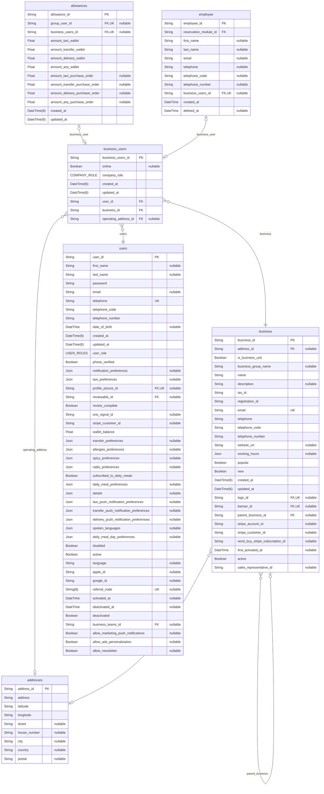

### `business_users`

User membership within a business (employees/managers).

Properties as follows:

- `business_users_id`:
- `online`:
- `company_role`:
- `created_at`:
- `updated_at`:
- `user_id`:
- `business_id`:
- `operating_address_id`:

### `allowances`

User allowances for different service wallets and purchase orders.

Properties as follows:

- `allowance_id`:
- `group_user_id`:
- `business_users_id`:
- `amount_taxi_wallet`:
- `amount_transfer_wallet`:
- `amount_delivery_wallet`:
- `amount_any_wallet`:
- `amount_taxi_purchase_order`:
- `amount_transfer_purchase_order`:
- `amount_delivery_purchase_order`:
- `amount_any_purchase_order`:
- `created_at`:
- `updated_at`:

### `employee`

Staff member performing services.

Properties as follows:

- `employee_id`:
- `reservation_module_id`:
- `first_name`:
- `last_name`:
- `email`:
- `telephone`:
- `telephone_code`:
- `telephone_number`:
- `business_users_id`:
- `created_at`:
- `deleted_at`:

## Cashback

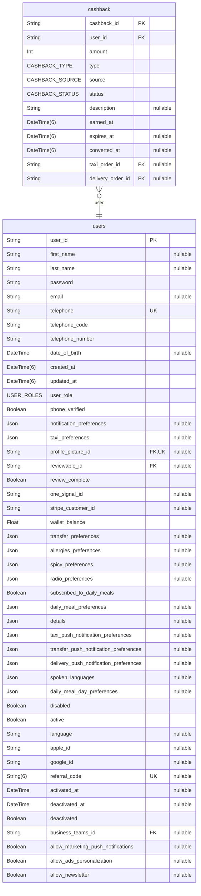

### `cashback`

Cashback rewards tied to orders or promotions.

Properties as follows:

- `cashback_id`:
- `user_id`:
- `amount`:
- `type`:
- `source`:
- `status`:
- `description`:
- `earned_at`:
- `expires_at`:
- `converted_at`:
- `taxi_order_id`:
- `delivery_order_id`:

## Referral

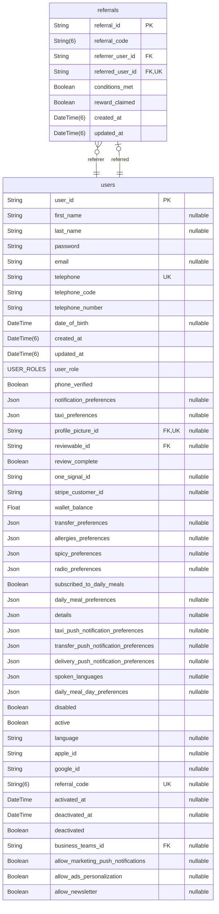

### `referrals`

Referral link between referrer and referred users.

Properties as follows:

- `referral_id`:
- `referral_code`:
- `referrer_user_id`:
- `referred_user_id`:
- `conditions_met`:
- `reward_claimed`:
- `created_at`:
- `updated_at`:

## FamilyUsers

```mermaid
erDiagram
"allowances" {
  String allowance_id PK
  String group_user_id FK,UK "nullable"
  String business_users_id FK,UK "nullable"
  Float amount_taxi_wallet
  Float amount_transfer_wallet
  Float amount_delivery_wallet
  Float amount_any_wallet
  Float amount_taxi_purchase_order "nullable"
  Float amount_transfer_purchase_order "nullable"
  Float amount_delivery_purchase_order "nullable"
  Float amount_any_purchase_order "nullable"
  DateTime(6) created_at
  DateTime(6) updated_at
}
"group_users" {
  String group_user_id PK
  String parent_user_id FK
  String child_user_id FK,UK
  DateTime(6) created_at
  DateTime(6) updated_at
  Boolean enabled
}
"users" {
  String user_id PK
  String first_name "nullable"
  String last_name "nullable"
  String password
  String email "nullable"
  String telephone UK
  String telephone_code
  String telephone_number
  DateTime date_of_birth "nullable"
  DateTime(6) created_at
  DateTime(6) updated_at
  USER_ROLES user_role
  Boolean phone_verified
  Json notification_preferences "nullable"
  Json taxi_preferences "nullable"
  String profile_picture_id FK,UK "nullable"
  String reviewable_id FK "nullable"
  Boolean review_complete
  String one_signal_id "nullable"
  String stripe_customer_id "nullable"
  Float wallet_balance
  Json transfer_preferences "nullable"
  Json allergies_preferences "nullable"
  Json spicy_preferences "nullable"
  Json radio_preferences "nullable"
  Boolean subscribed_to_daily_meals
  Json daily_meal_preferences "nullable"
  Json details "nullable"
  Json taxi_push_notification_preferences "nullable"
  Json transfer_push_notification_preferences "nullable"
  Json delivery_push_notification_preferences "nullable"
  Json spoken_languages "nullable"
  Json daily_meal_day_preferences "nullable"
  Boolean disabled
  Boolean active
  String language "nullable"
  String apple_id "nullable"
  String google_id "nullable"
  String(6) referral_code UK "nullable"
  DateTime activated_at "nullable"
  DateTime deactivated_at "nullable"
  Boolean deactivated
  String business_teams_id FK "nullable"
  Boolean allow_marketing_push_notifications "nullable"
  Boolean allow_ads_personalization "nullable"
  Boolean allow_newsletter "nullable"
}
"allowances" |o--o| "group_users" : user
"group_users" }o--|| "users" : parent_user
"group_users" |o--|| "users" : child_user
```

### `allowances`

User allowances for different service wallets and purchase orders.

Properties as follows:

- `allowance_id`:
- `group_user_id`:
- `business_users_id`:
- `amount_taxi_wallet`:
- `amount_transfer_wallet`:
- `amount_delivery_wallet`:
- `amount_any_wallet`:
- `amount_taxi_purchase_order`:
- `amount_transfer_purchase_order`:
- `amount_delivery_purchase_order`:
- `amount_any_purchase_order`:
- `created_at`:
- `updated_at`:

### `group_users`

Parent-child user relationship (household/group) with allowances.

Properties as follows:

- `group_user_id`:
- `parent_user_id`:
- `child_user_id`:
- `created_at`:
- `updated_at`:
- `enabled`:

## Documents

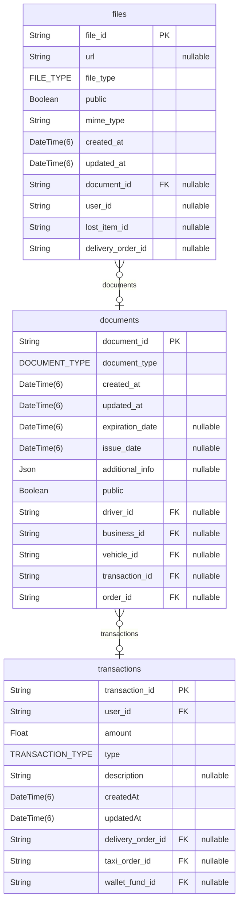

### `documents`

Documents attached to business, user, driver, vehicle, menu items or orders.

Properties as follows:

- `document_id`:
- `document_type`:
- `created_at`:
- `updated_at`:
- `expiration_date`:
- `issue_date`:
- `additional_info`:
- `public`:
- `driver_id`:
- `business_id`:
- `vehicle_id`:
- `transaction_id`:
- `order_id`:

## Files

```mermaid
erDiagram
"files" {
  String file_id PK
  String url "nullable"
  FILE_TYPE file_type
  Boolean public
  String mime_type
  DateTime(6) created_at
  DateTime(6) updated_at
  String document_id FK "nullable"
  String user_id "nullable"
  String lost_item_id "nullable"
  String delivery_order_id "nullable"
}
"business" {
  String business_id PK
  String address_id FK "nullable"
  Boolean is_business_unit
  String business_group_name "nullable"
  String name
  String description "nullable"
  String tax_id
  String registration_id
  String email UK
  String telephone
  String telephone_code
  String telephone_number
  String website_url "nullable"
  Json working_hours "nullable"
  Boolean popular
  Boolean new
  DateTime(6) created_at
  DateTime(6) updated_at
  String logo_id FK,UK "nullable"
  String banner_id FK,UK "nullable"
  String parent_business_id FK "nullable"
  String stripe_account_id "nullable"
  String stripe_customer_id "nullable"
  String word_buy_stripe_subscription_id "nullable"
  DateTime first_activated_at "nullable"
  Boolean active
  String sales_representative_id "nullable"
}
"documents" {
  String document_id PK
  DOCUMENT_TYPE document_type
  DateTime(6) created_at
  DateTime(6) updated_at
  DateTime(6) expiration_date "nullable"
  DateTime(6) issue_date "nullable"
  Json additional_info "nullable"
  Boolean public
  String driver_id FK "nullable"
  String business_id FK "nullable"
  String vehicle_id FK "nullable"
  String transaction_id FK "nullable"
  String order_id FK "nullable"
}
"lost_items" {
  String lost_item_id PK
  String user_id FK "nullable"
  LOST_FOUND_STATUS status
  String description
  String image_id FK,UK "nullable"
  Boolean found "nullable"
  DateTime(6) created_at
  DateTime(6) updated_at
}
"promo_banners" {
  String promo_banners_id PK
  String type
  String size "nullable"
  String title
  String text
  String promo_section_buy_id "nullable"
  String file_id FK
  String promo_ads_id FK "nullable"
}
"blog_posts" {
  String blog_posts_id PK
  String slug UK
  String title
  String short_content "nullable"
  String image_file_id FK "nullable"
  Json content
  BLOG_POST_STATUS status
  String author_id FK
  String category_id FK "nullable"
  DateTime(6) publish_at
  DateTime(6) created_at
  DateTime(6) updated_at
}
"delivery_orders" {
  String order_id PK
  String user_id FK "nullable"
  Json route
  Json pickup_location
  Json delivery_location
  Json payment "nullable"
  Json estimates "nullable"
  Json details "nullable"
  Json courier_instructions "nullable"
  Json restaurant_message "nullable"
  String rejection_reason "nullable"
  Json scheduled "nullable"
  Json timeline
  DELIVERY_ORDER_STATUS status
  DateTime(6) last_sent_at "nullable"
  DateTime(6) created_at
  DateTime(6) updated_at
  String vehicle_id FK "nullable"
  String driver_id FK "nullable"
  String transport_module_id FK "nullable"
  String payment_intent_id "nullable"
  Int find_drivers_attempts "nullable"
  Boolean is_daily_meal
  Boolean allow_credits_usage
  Int order_number
  String business_local_location_id FK "nullable"
  String review_id FK,UK "nullable"
  String stores_id FK "nullable"
  String food_drinks_id FK "nullable"
  String file_id FK,UK "nullable"
}
"categories" {
  String categories_id PK
  String name
  String description "nullable"
  String tag
  String icon_file_id FK "nullable"
  CATEGORY_TYPE category_type
  String parent_categories_id FK "nullable"
  String translatable_id FK
  DateTime(6) created_at
  DateTime(6) updated_at
  DateTime(6) deleted_at "nullable"
}
"menu_items" {
  String menu_item_id PK
  Json names
  String image "nullable"
  Json description
  String allergens
  Int spicy_level "nullable"
  String unit_size "nullable"
  Float price
  Float discount "nullable"
  String sides
  String extras
  Json ingredients
  String availability
  String business_id
  String menu_category_id FK "nullable"
  DateTime(6) daily_date "nullable"
  String image_file_id FK,UK "nullable"
  Boolean requires_id_check
  Boolean is_enabled
  Boolean is_copy
  Int menu_category_order_index "nullable"
  Json allergens_text "nullable"
  Json ingredients_text "nullable"
  Json usage_text "nullable"
  Json origin_text "nullable"
  Boolean is_weighted
  Float weight_quantity "nullable"
  Float stock "nullable"
  String latest_version_id "nullable"
  String tax_rates_id FK "nullable"
}
"users" {
  String user_id PK
  String first_name "nullable"
  String last_name "nullable"
  String password
  String email "nullable"
  String telephone UK
  String telephone_code
  String telephone_number
  DateTime date_of_birth "nullable"
  DateTime(6) created_at
  DateTime(6) updated_at
  USER_ROLES user_role
  Boolean phone_verified
  Json notification_preferences "nullable"
  Json taxi_preferences "nullable"
  String profile_picture_id FK,UK "nullable"
  String reviewable_id FK "nullable"
  Boolean review_complete
  String one_signal_id "nullable"
  String stripe_customer_id "nullable"
  Float wallet_balance
  Json transfer_preferences "nullable"
  Json allergies_preferences "nullable"
  Json spicy_preferences "nullable"
  Json radio_preferences "nullable"
  Boolean subscribed_to_daily_meals
  Json daily_meal_preferences "nullable"
  Json details "nullable"
  Json taxi_push_notification_preferences "nullable"
  Json transfer_push_notification_preferences "nullable"
  Json delivery_push_notification_preferences "nullable"
  Json spoken_languages "nullable"
  Json daily_meal_day_preferences "nullable"
  Boolean disabled
  Boolean active
  String language "nullable"
  String apple_id "nullable"
  String google_id "nullable"
  String(6) referral_code UK "nullable"
  DateTime activated_at "nullable"
  DateTime deactivated_at "nullable"
  Boolean deactivated
  String business_teams_id FK "nullable"
  Boolean allow_marketing_push_notifications "nullable"
  Boolean allow_ads_personalization "nullable"
  Boolean allow_newsletter "nullable"
}
"files" }o--o| "documents" : documents
"business" |o--o| "files" : logo
"business" |o--o| "files" : banner
"business" }o--o| "business" : parent_business
"documents" }o--o| "business" : business
"lost_items" |o--o| "files" : image
"lost_items" }o--o| "users" : user
"promo_banners" }o--|| "files" : files
"blog_posts" }o--o| "files" : image
"blog_posts" }o--|| "users" : author
"delivery_orders" }o--o| "users" : customer
"delivery_orders" |o--o| "files" : picture_of_delivery
"categories" }o--o| "files" : icon
"categories" }o--o| "categories" : parent_category
"menu_items" |o--o| "files" : image_file
"users" |o--o| "files" : profile_picture
```

### `files`

File storage for documents, images, logos, banners, menu items, blog posts, categories, promo banners and more.

Properties as follows:

- `file_id`:
- `url`:
- `file_type`:
- `public`:
- `mime_type`:
- `created_at`:
- `updated_at`:
- `document_id`:
- `user_id`:
- `lost_item_id`:
- `delivery_order_id`:

## Users

```mermaid
erDiagram
"tokens" {
  String token_id PK
  String user_id FK
  TokenType type
  String token UK
  DateTime(6) expires_at
  DateTime(6) created_at
  DateTime(6) updated_at
  Boolean active
}
"user_address" {
  String user_id FK
  String address_id FK
  Boolean primary
  Json details "nullable"
  ADDRESS_TYPE type
}
"reviews" {
  String review_id PK
  String reviewable_id FK
  String author_id FK
  Float rating "nullable"
  String comment "nullable"
  Json feedback "nullable"
  DateTime(6) created_at
  DateTime(6) updated_at
  String vehicle_id "nullable"
}
"service_links" {
  String id PK
  String name UK
  DateTime(6) created_at
  DateTime(6) updated_at
}
"tutorial" {
  String tutorial_id PK
  String key UK
  String title
  Int version
  Boolean mandatory
  DateTime(6) createdAt
  DateTime retiredAt "nullable"
}
"user_tutorial_state" {
  String id PK
  String user_id FK,UK
  Int epoch
  DateTime(6) updatedAt
}
"users" {
  String user_id PK
  String first_name "nullable"
  String last_name "nullable"
  String password
  String email "nullable"
  String telephone UK
  String telephone_code
  String telephone_number
  DateTime date_of_birth "nullable"
  DateTime(6) created_at
  DateTime(6) updated_at
  USER_ROLES user_role
  Boolean phone_verified
  Json notification_preferences "nullable"
  Json taxi_preferences "nullable"
  String profile_picture_id FK,UK "nullable"
  String reviewable_id FK "nullable"
  Boolean review_complete
  String one_signal_id "nullable"
  String stripe_customer_id "nullable"
  Float wallet_balance
  Json transfer_preferences "nullable"
  Json allergies_preferences "nullable"
  Json spicy_preferences "nullable"
  Json radio_preferences "nullable"
  Boolean subscribed_to_daily_meals
  Json daily_meal_preferences "nullable"
  Json details "nullable"
  Json taxi_push_notification_preferences "nullable"
  Json transfer_push_notification_preferences "nullable"
  Json delivery_push_notification_preferences "nullable"
  Json spoken_languages "nullable"
  Json daily_meal_day_preferences "nullable"
  Boolean disabled
  Boolean active
  String language "nullable"
  String apple_id "nullable"
  String google_id "nullable"
  String(6) referral_code UK "nullable"
  DateTime activated_at "nullable"
  DateTime deactivated_at "nullable"
  Boolean deactivated
  String business_teams_id FK "nullable"
  Boolean allow_marketing_push_notifications "nullable"
  Boolean allow_ads_personalization "nullable"
  Boolean allow_newsletter "nullable"
}
"user_roles" {
  String user_roles_id PK
  String user_id FK
  USER_ROLES role
  Boolean primary "nullable"
}
"role" {
  String role_id PK
  String name
  MODULE_TYPE module
  String business_id FK "nullable"
  Boolean is_admin
}
"user_role" {
  String user_id PK,FK
  String role_id FK
  String reservation_module_id FK "nullable"
}
"role_permission" {
  String role_permission_id PK
  String role_id FK
  String permission_id FK
}
"permission" {
  String permission_id PK
  String action_id FK "nullable"
  String name "nullable"
  String description "nullable"
  String display_name "nullable"
  MODULE_TYPE module
  Int limit "nullable"
  PERMISSION_SCOPE scope
  String group "nullable"
}
"user_permission" {
  String user_permission_id PK
  String user_id FK
  String reservation_module_id FK "nullable"
  String action_id FK "nullable"
  String name "nullable"
  String display_name "nullable"
  MODULE_TYPE module
  Int limit "nullable"
  PERMISSION_SCOPE scope
  Boolean is_blocked
}
"group_users" {
  String group_user_id PK
  String parent_user_id FK
  String child_user_id FK,UK
  DateTime(6) created_at
  DateTime(6) updated_at
  Boolean enabled
}
"scoring_points" {
  String scoring_points_id PK
  String business_id FK
  String user_id FK "nullable"
  String delivery_order_id FK "nullable"
  String taxi_order_id FK "nullable"
  Int points
  Boolean isPenalty
  SCORING_POINTS_REASON reason
  DateTime expiration_date "nullable"
  DateTime(6) created_at
  DateTime(6) updated_at
}
"account_actions" {
  String account_action_id PK
  String business_id FK "nullable"
  String user_id FK "nullable"
  DateTime(6) created_at
  String action_creator_user_id FK
  ACCOUNT_ACTIONS_REASON reason
  ACCOUNT_ACTIONS action
}
"employee" {
  String employee_id PK
  String reservation_module_id FK
  String first_name "nullable"
  String last_name "nullable"
  String email "nullable"
  String telephone "nullable"
  String telephone_code "nullable"
  String telephone_number "nullable"
  String business_users_id FK,UK "nullable"
  DateTime created_at
  DateTime deleted_at "nullable"
}
"customers" {
  String customer_id PK
  String reservation_module_id FK
  String first_name
  String last_name
  String email "nullable"
  String telephone "nullable"
  DateTime created_at
  DateTime updated_at
  String(16) code UK
  String user_id FK "nullable"
}
"business" {
  String business_id PK
  String address_id FK "nullable"
  Boolean is_business_unit
  String business_group_name "nullable"
  String name
  String description "nullable"
  String tax_id
  String registration_id
  String email UK
  String telephone
  String telephone_code
  String telephone_number
  String website_url "nullable"
  Json working_hours "nullable"
  Boolean popular
  Boolean new
  DateTime(6) created_at
  DateTime(6) updated_at
  String logo_id FK,UK "nullable"
  String banner_id FK,UK "nullable"
  String parent_business_id FK "nullable"
  String stripe_account_id "nullable"
  String stripe_customer_id "nullable"
  String word_buy_stripe_subscription_id "nullable"
  DateTime first_activated_at "nullable"
  Boolean active
  String sales_representative_id "nullable"
}
"files" {
  String file_id PK
  String url "nullable"
  FILE_TYPE file_type
  Boolean public
  String mime_type
  DateTime(6) created_at
  DateTime(6) updated_at
  String document_id FK "nullable"
  String user_id "nullable"
  String lost_item_id "nullable"
  String delivery_order_id "nullable"
}
"addresses" {
  String address_id PK
  String address
  String latitude
  String longitude
  String street "nullable"
  String house_number "nullable"
  String city "nullable"
  String country "nullable"
  String postal "nullable"
}
"transactions" {
  String transaction_id PK
  String user_id FK
  Float amount
  TRANSACTION_TYPE type
  String description "nullable"
  DateTime(6) createdAt
  DateTime(6) updatedAt
  String delivery_order_id FK "nullable"
  String taxi_order_id FK "nullable"
  String wallet_fund_id FK "nullable"
}
"user_money_flows" {
  String balance_change_id PK
  String user_id FK
  Float amount
  Float stripe_fee
  TRANSACTION_TYPE type
  PAYMENT_METHOD payment_method "nullable"
  DateTime(6) created_at
}
"lost_items" {
  String lost_item_id PK
  String user_id FK "nullable"
  LOST_FOUND_STATUS status
  String description
  String image_id FK,UK "nullable"
  Boolean found "nullable"
  DateTime(6) created_at
  DateTime(6) updated_at
}
"wallet_funds" {
  String wallet_funds_id PK
  String user_id FK
  String referral_id FK "nullable"
  String charge_id "nullable"
  Int amount
  String reserved_order "nullable"
  String reserved_daily_meals_subscription "nullable"
  String reserved_business "nullable"
  DateTime(6) created_at
  DateTime(6) updated_at
  DateTime(6) expires_at "nullable"
  FUNDS_TYPE type
  CREDIT_STATUS status "nullable"
}
"drivers" {
  String driver_id PK
  String transport_module_id FK "nullable"
  Boolean online "nullable"
  Boolean on_order "nullable"
  Json working_hours "nullable"
  Json ride_requirements "nullable"
  DateTime(6) created_at
  DateTime(6) updated_at
  String user_id FK,UK "nullable"
  String current_vehicle_id FK,UK "nullable"
  String last_used_vehicle_id "nullable"
  Json location "nullable"
  Json delivery_timeline "nullable"
  DateTime(6) last_ping_at
  Boolean is_inactive "nullable"
  Json transfer_requirements "nullable"
  String regions
  Boolean handles_taxi_orders "nullable"
  Boolean handles_transfer_orders "nullable"
  Boolean handles_courier_orders "nullable"
  Boolean handles_delivery_orders "nullable"
  Boolean taxi_orders_toggled "nullable"
  Boolean transfer_orders_toggled "nullable"
  Boolean courier_orders_toggled "nullable"
  Boolean delivery_orders_toggled "nullable"
  Float partner_cash_balance "nullable"
  DateTime(6) come_to_work_last_sent_at "nullable"
  Boolean delivers_daily_meals "nullable"
  Boolean on_daily_meals "nullable"
  Json scheduled_meals_route "nullable"
  VEHICLE_TYPE vehicle_type "nullable"
  String reviewable_id FK "nullable"
}
"tokens" }o--|| "users" : users
"user_address" }o--|| "users" : users
"user_address" }o--|| "addresses" : address
"reviews" }o--|| "users" : author
"user_tutorial_state" |o--|| "users" : user
"users" |o--o| "files" : profile_picture
"user_roles" }o--|| "users" : user
"role" }o--o| "business" : business
"user_role" |o--|| "users" : user
"user_role" }o--|| "role" : role
"role_permission" }o--|| "role" : role
"role_permission" }o--|| "permission" : permission
"user_permission" }o--|| "users" : user
"group_users" }o--|| "users" : parent_user
"group_users" |o--|| "users" : child_user
"scoring_points" }o--o| "users" : users
"scoring_points" }o--|| "business" : businesses
"account_actions" }o--o| "business" : business
"account_actions" }o--o| "users" : user
"account_actions" }o--|| "users" : action_creator
"customers" }o--o| "users" : user
"business" }o--o| "addresses" : address
"business" |o--o| "files" : logo
"business" |o--o| "files" : banner
"business" }o--o| "business" : parent_business
"transactions" }o--|| "users" : user
"transactions" }o--o| "wallet_funds" : wallet_funds
"user_money_flows" }o--|| "users" : user
"lost_items" |o--o| "files" : image
"lost_items" }o--o| "users" : user
"wallet_funds" }o--|| "users" : user
"drivers" |o--o| "users" : user
"reviews" }o--o{ "users" : "via reviewable"
"users" }o--o{ "business" : "via user_favorite_businesses"
"users" }o--o{ "drivers" : "via user_favorite_drivers"
"users" }o--o{ "service_links" : "via user_favorite_service_links"
"users" }o--o{ "tutorial" : "via user_tutorials"
```

### `tokens`

API and session tokens for users.

Properties as follows:

- `token_id`:
- `user_id`:
- `type`:
- `token`:
- `expires_at`:
- `created_at`:
- `updated_at`:
- `active`:

### `user_address`

User address book entries linking users to addresses.

Properties as follows:

- `user_id`:
- `address_id`:
- `primary`:
- `details`:
- `type`:

### `reviews`

Review record authored by a user about a business or user.

Properties as follows:

- `review_id`:
- `reviewable_id`:
- `author_id`:
- `rating`:
- `comment`:
- `feedback`:
- `created_at`:
- `updated_at`:
- `vehicle_id`:

### `service_links`

Klikni service links (e.g., taxi, courier, stores) that can be favorited by users on home screen.

Properties as follows:

- `id`:
- `name`:
- `created_at`:
- `updated_at`:

### `tutorial`

Tutorials available in the system.

Properties as follows:

- `tutorial_id`:
- `key`:
- `title`:
- `version`:
- `mandatory`:
- `createdAt`:
- `retiredAt`:

### `user_tutorial_state`

State of user tutorials.

Properties as follows:

- `id`:
- `user_id`:
- `epoch`:
- `updatedAt`:

### `users`

End user account with profile, preferences and relations.

Central user entity linking to roles, orders, documents, wallets and analytics.

Properties as follows:

- `user_id`:
- `first_name`:
- `last_name`:
- `password`:
- `email`:
- `telephone`:
- `telephone_code`:
- `telephone_number`:
- `date_of_birth`:
- `created_at`:
- `updated_at`:
- `user_role`:
- `phone_verified`:
- `notification_preferences`:
- `taxi_preferences`:
- `profile_picture_id`:
- `reviewable_id`:
- `review_complete`:
- `one_signal_id`:
- `stripe_customer_id`:
- `wallet_balance`:
- `transfer_preferences`:
- `allergies_preferences`:
- `spicy_preferences`:
- `radio_preferences`:
- `subscribed_to_daily_meals`:
- `daily_meal_preferences`:
- `details`:
- `taxi_push_notification_preferences`:
- `transfer_push_notification_preferences`:
- `delivery_push_notification_preferences`:
- `spoken_languages`:
- `daily_meal_day_preferences`:
- `disabled`:
- `active`:
- `language`:
- `apple_id`:
- `google_id`:
- `referral_code`:
- `activated_at`:
- `deactivated_at`:
- `deactivated`:
- `business_teams_id`:
- `allow_marketing_push_notifications`:
- `allow_ads_personalization`:
- `allow_newsletter`:

### `user_roles`

User role assignments (simple historical list, not RBAC).

Properties as follows:

- `user_roles_id`:
- `user_id`:
- `role`:
- `primary`:

### `role`

Role definition for RBAC per module and optionally per business.

Properties as follows:

- `role_id`:
- `name`:
- `module`:
- `business_id`:
- `is_admin`:

### `user_role`

User-to-role assignment (optionally scoped to a reservation module).

Properties as follows:

- `user_id`:
- `role_id`:
- `reservation_module_id`:

### `role_permission`

Role-to-permission mapping.

Properties as follows:

- `role_permission_id`:
- `role_id`:
- `permission_id`:

### `permission`

Permission definition (action-based or named), with scope and module.

Properties as follows:

- `permission_id`:
- `action_id`:
- `name`:
- `description`:
- `display_name`:
- `module`:
- `limit`:
- `scope`:
- `group`:

### `user_permission`

User-specific permission overrides (grants/limits/blocks).

Properties as follows:

- `user_permission_id`:
- `user_id`:
- `reservation_module_id`:
- `action_id`:
- `name`:
- `display_name`:
- `module`:
- `limit`:
- `scope`:
- `is_blocked`:

### `group_users`

Parent-child user relationship (household/group) with allowances.

Properties as follows:

- `group_user_id`:
- `parent_user_id`:
- `child_user_id`:
- `created_at`:
- `updated_at`:
- `enabled`:

### `scoring_points`

Scoring points (rewards/penalties) for users and businesses.

Properties as follows:

- `scoring_points_id`:
- `business_id`:
- `user_id`:
- `delivery_order_id`:
- `taxi_order_id`:
- `points`:
- `isPenalty`:
- `reason`:
- `expiration_date`:
- `created_at`:
- `updated_at`:

### `account_actions`

Moderation/account actions affecting user or business accounts.

Properties as follows:

- `account_action_id`:
- `business_id`:
- `user_id`:
- `created_at`:
- `action_creator_user_id`:
- `reason`:
- `action`:

### `employee`

Staff member performing services.

Properties as follows:

- `employee_id`:
- `reservation_module_id`:
- `first_name`:
- `last_name`:
- `email`:
- `telephone`:
- `telephone_code`:
- `telephone_number`:
- `business_users_id`:
- `created_at`:
- `deleted_at`:

### `customers`

Customer tracked by a reservation module.

Properties as follows:

- `customer_id`:
- `reservation_module_id`:
- `first_name`:
- `last_name`:
- `email`:
- `telephone`:
- `created_at`:
- `updated_at`:
- `code`:
- `user_id`:

## Addresses

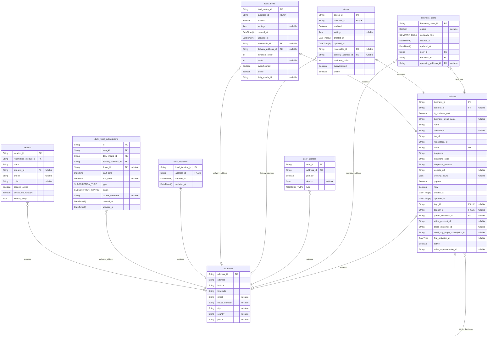

### `addresses`

Postal/geo address used by businesses, users and modules.

Properties as follows:

- `address_id`:
- `address`:
- `latitude`:
- `longitude`:
- `street`:
- `house_number`:
- `city`:
- `country`:
- `postal`:

## Payments

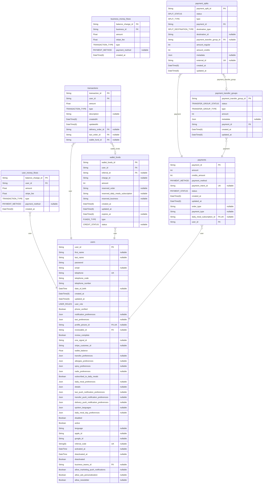

### `transactions`

Ledger transactions for users and orders (credit/debit entries).

Properties as follows:

- `transaction_id`:
- `user_id`:
- `amount`:
- `type`:
- `description`:
- `createdAt`:
- `updatedAt`:
- `delivery_order_id`:
- `taxi_order_id`:
- `wallet_fund_id`:

### `user_money_flows`

Money flow entries for a user (credits/debits and fees).

Properties as follows:

- `balance_change_id`:
- `user_id`:
- `amount`:
- `stripe_fee`:
- `type`:
- `payment_method`:
- `created_at`:

### `business_money_flows`

Money flow entries for a business (credits/debits and fees).

Properties as follows:

- `balance_change_id`:
- `business_id`:
- `amount`:
- `stripe_fee`:
- `type`:
- `payment_method`:
- `created_at`:

### `payments`

Payments and statuses (with splits and transfer groups).

Properties as follows:

- `payment_id`:
- `amount`:
- `credits_amount`:
- `payment_method`:
- `payment_intent_id`:
- `status`:
- `created_at`:
- `updated_at`:
- `order_type`:
- `payment_type`:
- `daily_meal_subscription_id`:
- `user_id`:

### `payment_splits`

Properties as follows:

- `payment_split_id`:
- `status`:
- `type`:
- `payment_id`:
- `destination_type`:
- `destination_id`:
- `payment_transfer_group_id`:
- `amount_regular`:
- `amount_credits`:
- `metadata`:
- `external_id`:
- `created_at`:
- `updated_at`:

### `payment_transfer_groups`

Properties as follows:

- `payment_transfer_group_id`:
- `status`:
- `type`:
- `amount`:
- `metadata`:
- `payment_id`:
- `created_at`:
- `updated_at`:

## LostItems

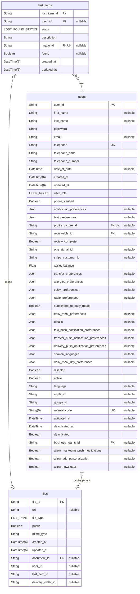

### `lost_items`

Lost and found items reported by users/drivers.

Properties as follows:

- `lost_item_id`:
- `user_id`:
- `status`:
- `description`:
- `image_id`:
- `found`:
- `created_at`:
- `updated_at`:

## Wallet

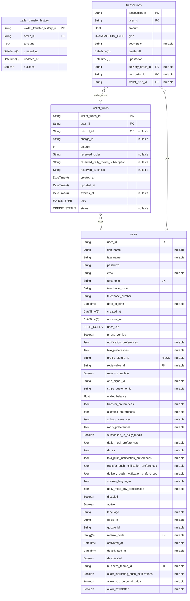

### `wallet_transfer_history`

Wallet transfer history for taxi and delivery orders.

Properties as follows:

- `wallet_transfer_history_id`:
- `order_id`:
- `amount`:
- `created_at`:
- `updated_at`:
- `success`:

### `wallet_funds`

Wallet and credit balances for users with optional expiry and reservations.

Properties as follows:

- `wallet_funds_id`:
- `user_id`:
- `referral_id`:
- `charge_id`:
- `amount`:
- `reserved_order`:
- `reserved_daily_meals_subscription`:
- `reserved_business`:
- `created_at`:
- `updated_at`:
- `expires_at`:
- `type`:
- `status`:

## PromoSections

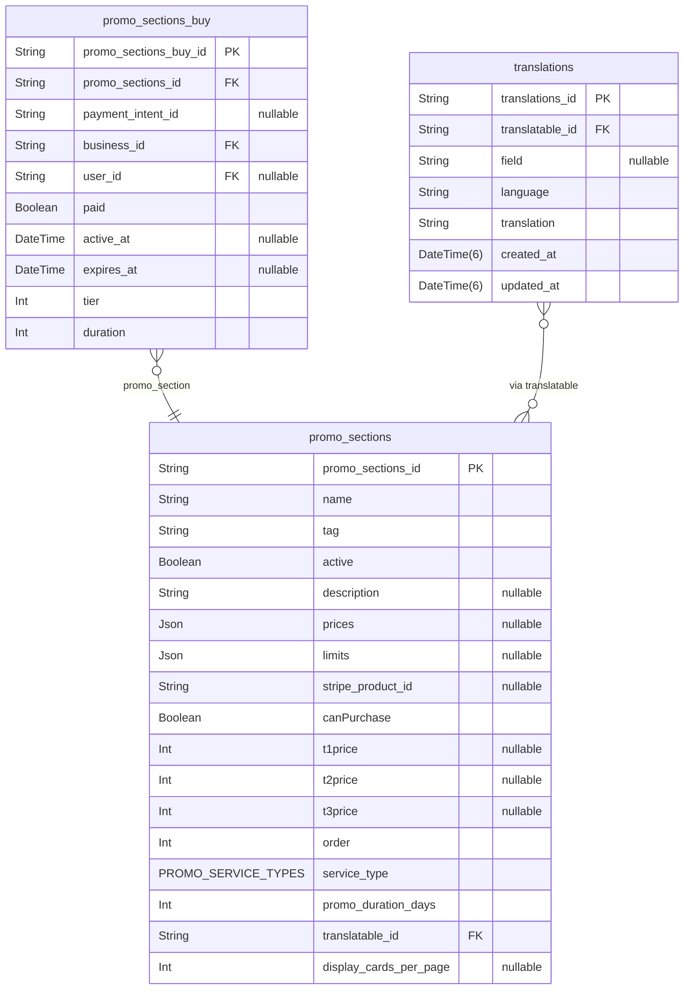

### `promo_sections`

Configurable promotional sections purchasable by businesses.

Properties as follows:

- `promo_sections_id`:
- `name`:
- `tag`:
- `active`:
- `description`:
- `prices`:
- `limits`:
- `stripe_product_id`:
- `canPurchase`:
- `t1price`:
- `t2price`:
- `t3price`:
- `order`:
- `service_type`:
- `promo_duration_days`:
- `translatable_id`:
- `display_cards_per_page`:

### `promo_sections_buy`

Purchase of a promo section placement by a business.

Properties as follows:

- `promo_sections_buy_id`:
- `promo_sections_id`:
- `payment_intent_id`:
- `business_id`:
- `user_id`:
- `paid`:
- `active_at`:
- `expires_at`:
- `tier`:
- `duration`:

## PromoAds

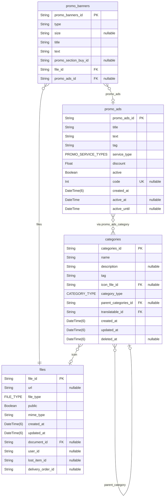

### `promo_banners`

Visual assets attached to promo ads or section buys.

Properties as follows:

- `promo_banners_id`:
- `type`:
- `size`:
- `title`:
- `text`:
- `promo_section_buy_id`:
- `file_id`:
- `promo_ads_id`:

### `promo_ads`

Promotional advertisements with categories and analytics.

Properties as follows:

- `promo_ads_id`:
- `title`:
- `text`:
- `tag`:
- `service_type`:
- `discount`:
- `active`:
- `code`:
- `created_at`:
- `active_at`:
- `active_until`:

## PromoWords

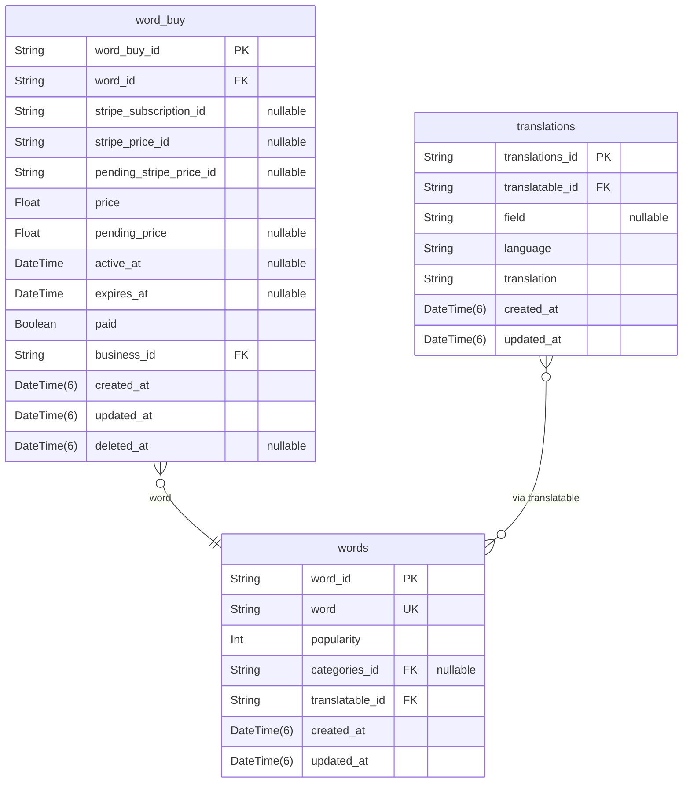

### `words`

Search words/tags that can be promoted and analyzed.

Properties as follows:

- `word_id`:
- `word`:
- `popularity`:
- `categories_id`:
- `translatable_id`:
- `created_at`:
- `updated_at`:

### `word_buy`

Subscription/purchase of promoted word by a business.

Properties as follows:

- `word_buy_id`:
- `word_id`:
- `stripe_subscription_id`:
- `stripe_price_id`:
- `pending_stripe_price_id`:
- `price`:
- `pending_price`:
- `active_at`:
- `expires_at`:
- `paid`:
- `business_id`:
- `created_at`:
- `updated_at`:
- `deleted_at`:

## Promo

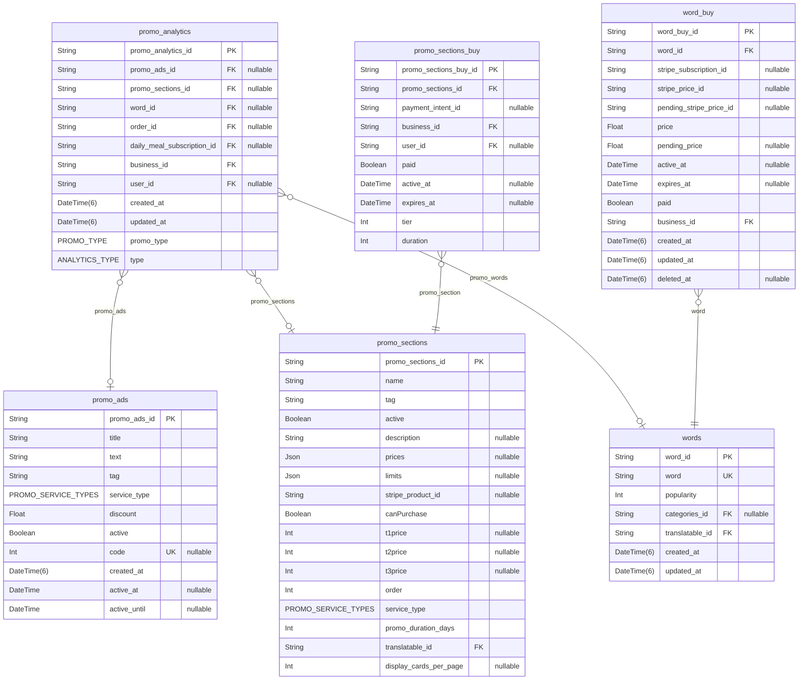

### `promo_analytics`

Analytics events for promotions and searches associated to a business.

Properties as follows:

- `promo_analytics_id`:
- `promo_ads_id`:
- `promo_sections_id`:
- `word_id`:
- `order_id`:
- `daily_meal_subscription_id`:
- `business_id`:
- `user_id`:
- `created_at`:
- `updated_at`:
- `promo_type`:
- `type`:

## Drivers

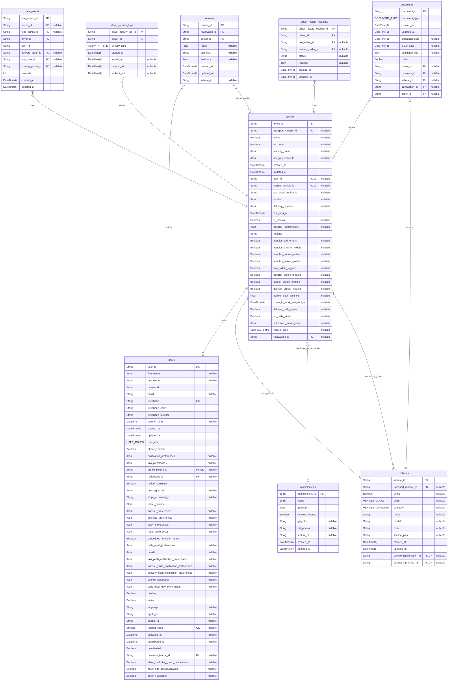

### `late_events`

Recorded late events for orders impacting scoring.

Properties as follows:

- `late_events_id`:
- `stores_id`:
- `food_drinks_id`:
- `driver_id`:
- `user_id`:
- `delivery_order_id`:
- `taxi_order_id`:
- `scoring_points_id`:
- `seconds`:
- `created_at`:
- `updated_at`:

### `driver_activity_logs`

Timeline of a driver's activities and timeouts.

Properties as follows:

- `driver_activity_log_id`:
- `driver_id`:
- `activity_type`:
- `started_at`:
- `ended_at`:
- `timeout_at`:
- `lockout_until`:

### `driver_history_locations`

Historical location records for drivers during orders.

Properties as follows:

- `driver_history_location_id`:
- `driver_id`:
- `taxi_order_id`:
- `delivery_order_id`:
- `status`:
- `location`:
- `created_at`:
- `updated_at`:

### `drivers`

Driver entity linked to a user and (optionally) a transport module.

Tracks online state, capabilities, documents, orders and current vehicle.

Properties as follows:

- `driver_id`:
- `transport_module_id`:
- `online`:
- `on_order`:
- `working_hours`:
- `ride_requirements`:
- `created_at`:
- `updated_at`:
- `user_id`:
- `current_vehicle_id`:
- `last_used_vehicle_id`:
- `location`:
- `delivery_timeline`:
- `last_ping_at`:
- `is_inactive`:
- `transfer_requirements`:
- `regions`:
- `handles_taxi_orders`:
- `handles_transfer_orders`:
- `handles_courier_orders`:
- `handles_delivery_orders`:
- `taxi_orders_toggled`:
- `transfer_orders_toggled`:
- `courier_orders_toggled`:
- `delivery_orders_toggled`:
- `partner_cash_balance`:
- `come_to_work_last_sent_at`:
- `delivers_daily_meals`:
- `on_daily_meals`:
- `scheduled_meals_route`:
- `vehicle_type`:
- `reviewable_id`:

### `driver_activity_settings`

Global settings for driver activity and lockouts

Properties as follows:

- `driver_activity_settings_id`:
- `first_offline_lockout`:
- `second_offline_lockout`:
- `online_timeout`:
- `created_at`:
- `updated_at`:
- `active`:

## Blog

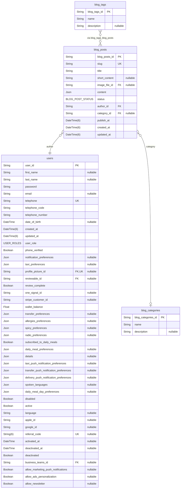

### `blog_tags`

Blog tags, categories and posts with relations.

Properties as follows:

- `blog_tags_id`:
- `name`:
- `description`:

### `blog_categories`

Blog categories and their posts.

Properties as follows:

- `blog_categories_id`:
- `name`:
- `description`:

### `blog_posts`

Blog posts with authors, categories, tags and content.

Properties as follows:

- `blog_posts_id`:
- `slug`:
- `title`:
- `short_content`:
- `image_file_id`:
- `content`:
- `status`:
- `author_id`:
- `category_id`:
- `publish_at`:
- `created_at`:
- `updated_at`:

## Regions

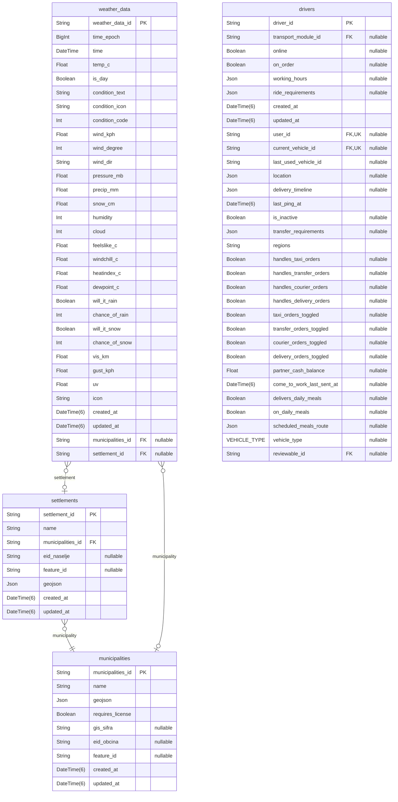

### `municipalities`

Municipalities and settlements with geojson and weather data, linked to drivers.

Properties as follows:

- `municipalities_id`:
- `name`:
- `geojson`:
- `requires_license`:
- `gis_sifra`:
- `eid_obcina`:
- `feature_id`:
- `created_at`:
- `updated_at`:

### `settlements`

Settlements linked to municipalities with geojson and weather data.

Properties as follows:

- `settlement_id`:
- `name`:
- `municipalities_id`:
- `eid_naselje`:
- `feature_id`:
- `geojson`:
- `created_at`:
- `updated_at`:

### `weather_data`

Weather data linked to municipalities and settlements.

Properties as follows:

- `weather_data_id`:
- `time_epoch`:
- `time`:
- `temp_c`:
- `is_day`:
- `condition_text`:
- `condition_icon`:
- `condition_code`:
- `wind_kph`:
- `wind_degree`:
- `wind_dir`:
- `pressure_mb`:
- `precip_mm`:
- `snow_cm`:
- `humidity`:
- `cloud`:
- `feelslike_c`:
- `windchill_c`:
- `heatindex_c`:
- `dewpoint_c`:
- `will_it_rain`:
- `chance_of_rain`:
- `will_it_snow`:
- `chance_of_snow`:
- `vis_km`:
- `gust_kph`:
- `uv`:
- `icon`:
- `created_at`:
- `updated_at`:
- `municipalities_id`:
- `settlement_id`:

## CRM

```mermaid
erDiagram
"crm_module" {
  String crm_module_id PK
  String business_id FK,UK
  Float purchase_order_limit_amount "nullable"
  DateTime(6) created_at
  DateTime(6) updated_at
}
"business_clients" {
  String business_clients_id PK
  DateTime(6) created_at
  DateTime(6) updated_at
  String crm_module_id FK
  String first_name "nullable"
  String last_name "nullable"
  String email "nullable"
  String telephone
  String telephone_code
  String telephone_number
}
"business_teams" {
  String business_teams_id PK
  String team_name
  String crm_module_id FK
  Float limit_per_person
  DateTime(6) created_at
  DateTime(6) updated_at
}
"business" {
  String business_id PK
  String address_id FK "nullable"
  Boolean is_business_unit
  String business_group_name "nullable"
  String name
  String description "nullable"
  String tax_id
  String registration_id
  String email UK
  String telephone
  String telephone_code
  String telephone_number
  String website_url "nullable"
  Json working_hours "nullable"
  Boolean popular
  Boolean new
  DateTime(6) created_at
  DateTime(6) updated_at
  String logo_id FK,UK "nullable"
  String banner_id FK,UK "nullable"
  String parent_business_id FK "nullable"
  String stripe_account_id "nullable"
  String stripe_customer_id "nullable"
  String word_buy_stripe_subscription_id "nullable"
  DateTime first_activated_at "nullable"
  Boolean active
  String sales_representative_id "nullable"
}
"business_users" {
  String business_users_id PK
  Boolean online "nullable"
  COMPANY_ROLE company_role
  DateTime(6) created_at
  DateTime(6) updated_at
  String user_id FK
  String business_id FK
  String operating_address_id FK "nullable"
}
"users" {
  String user_id PK
  String first_name "nullable"
  String last_name "nullable"
  String password
  String email "nullable"
  String telephone UK
  String telephone_code
  String telephone_number
  DateTime date_of_birth "nullable"
  DateTime(6) created_at
  DateTime(6) updated_at
  USER_ROLES user_role
  Boolean phone_verified
  Json notification_preferences "nullable"
  Json taxi_preferences "nullable"
  String profile_picture_id FK,UK "nullable"
  String reviewable_id FK "nullable"
  Boolean review_complete
  String one_signal_id "nullable"
  String stripe_customer_id "nullable"
  Float wallet_balance
  Json transfer_preferences "nullable"
  Json allergies_preferences "nullable"
  Json spicy_preferences "nullable"
  Json radio_preferences "nullable"
  Boolean subscribed_to_daily_meals
  Json daily_meal_preferences "nullable"
  Json details "nullable"
  Json taxi_push_notification_preferences "nullable"
  Json transfer_push_notification_preferences "nullable"
  Json delivery_push_notification_preferences "nullable"
  Json spoken_languages "nullable"
  Json daily_meal_day_preferences "nullable"
  Boolean disabled
  Boolean active
  String language "nullable"
  String apple_id "nullable"
  String google_id "nullable"
  String(6) referral_code UK "nullable"
  DateTime activated_at "nullable"
  DateTime deactivated_at "nullable"
  Boolean deactivated
  String business_teams_id FK "nullable"
  Boolean allow_marketing_push_notifications "nullable"
  Boolean allow_ads_personalization "nullable"
  Boolean allow_newsletter "nullable"
}
"crm_module" |o--|| "business" : business
"business_clients" }o--|| "crm_module" : crm_module
"business_teams" }o--|| "crm_module" : crm_module
"business" }o--o| "business" : parent_business
"business_users" }o--|| "users" : users
"business_users" }o--|| "business" : business
"users" }o--o| "business_teams" : business_teams
```

### `crm_module`

CRM module for non-partnered business accounts.

Holds configuration for businesses using CRM features without being full platform partners.
Links to client contacts and internal teams.

Properties as follows:

- `crm_module_id`:
- `business_id`:
- `purchase_order_limit_amount`:
- `created_at`:
- `updated_at`:

### `business_clients`

Client contacts managed by a CRM module.

Represents end customers of a business using CRM. Telephone is unique per CRM module
to avoid duplicate client records within the same business context.

Properties as follows:

- `business_clients_id`:
- `created_at`:
- `updated_at`:
- `crm_module_id`:
- `first_name`:
- `last_name`:
- `email`:
- `telephone`:
- `telephone_code`:
- `telephone_number`:

### `business_teams`

Internal teams/groups within a CRM module.

Used to organize users into teams with optional per-person limits for purchases or actions.

Properties as follows:

- `business_teams_id`:
- `team_name`:
- `crm_module_id`:
- `limit_per_person`:
- `created_at`:
- `updated_at`:

## Stores

```mermaid
erDiagram
"stores" {
  String stores_id PK
  String business_id FK,UK
  Boolean enabled
  Json settings "nullable"
  DateTime(6) created_at
  DateTime(6) updated_at
  String reviewable_id FK "nullable"
  String delivery_address_id FK "nullable"
  Int minimum_order
  Boolean overwhelmed
  Boolean online
}
"business_local_locations" {
  String business_local_location_id PK
  String stores_id FK
  String local_location_id FK
  DateTime(6) created_at
  DateTime(6) updated_at
  DateTime(6) time
}
"local_locations" {
  String local_location_id PK
  String address_id FK,UK
  DateTime(6) created_at
  DateTime(6) updated_at
}
"business" {
  String business_id PK
  String address_id FK "nullable"
  Boolean is_business_unit
  String business_group_name "nullable"
  String name
  String description "nullable"
  String tax_id
  String registration_id
  String email UK
  String telephone
  String telephone_code
  String telephone_number
  String website_url "nullable"
  Json working_hours "nullable"
  Boolean popular
  Boolean new
  DateTime(6) created_at
  DateTime(6) updated_at
  String logo_id FK,UK "nullable"
  String banner_id FK,UK "nullable"
  String parent_business_id FK "nullable"
  String stripe_account_id "nullable"
  String stripe_customer_id "nullable"
  String word_buy_stripe_subscription_id "nullable"
  DateTime first_activated_at "nullable"
  Boolean active
  String sales_representative_id "nullable"
}
"reviews" {
  String review_id PK
  String reviewable_id FK
  String author_id FK
  Float rating "nullable"
  String comment "nullable"
  Json feedback "nullable"
  DateTime(6) created_at
  DateTime(6) updated_at
  String vehicle_id "nullable"
}
"menus" {
  String menu_id PK
  String stores_id FK "nullable"
  String food_drinks_id FK "nullable"
  Boolean active
  Json menu_categories_ordered "nullable"
  Boolean isDailyMeal
  DateTime date "nullable"
}
"order_lobbies" {
  String order_lobbies_id PK
  String lobby_name
  String lobby_description
  Boolean active
  Json delivery_location "nullable"
  String courier_note "nullable"
  String restaurant_message "nullable"
  String stores_id FK
  String food_drinks_id FK "nullable"
  String creator_id
  String delivery_orders_id FK,UK "nullable"
  DateTime(6) created_at
  DateTime(6) updated_at
}
"stores" |o--|| "business" : business
"business_local_locations" }o--|| "local_locations" : local_location
"business_local_locations" }o--|| "stores" : stores
"business" }o--o| "business" : parent_business
"menus" }o--o| "stores" : stores
"order_lobbies" }o--|| "stores" : stores
"reviews" }o--o{ "stores" : "via reviewable"
```

### `stores`

Storefront settings for a business (Delivery module).

Holds store configuration, delivery address, menus and order lobbies.

Properties as follows:

- `stores_id`:
- `business_id`:
- `enabled`:
- `settings`:
- `created_at`:
- `updated_at`:
- `reviewable_id`:
- `delivery_address_id`:
- `minimum_order`:
- `overwhelmed`:
- `online`:

### `business_local_locations`

Business-local locations for pickup/delivery windows.

Defines time-based local pickup/delivery points bound to a store location.

Properties as follows:

- `business_local_location_id`:
- `stores_id`:
- `local_location_id`:
- `created_at`:
- `updated_at`:
- `time`:

### `local_locations`

Geocoded local locations linked to addresses.

Unique wrapper over an address used for local pickup/delivery points.

Properties as follows:

- `local_location_id`:
- `address_id`:
- `created_at`:
- `updated_at`:

## FoodDrinks

```mermaid
erDiagram
"food_drinks" {
  String food_drinks_id PK
  String business_id FK,UK
  Boolean enabled
  Json settings "nullable"
  DateTime(6) created_at
  DateTime(6) updated_at
  String reviewable_id FK "nullable"
  String delivery_address_id FK "nullable"
  Int minimum_order
  Int seats "nullable"
  Boolean overwhelmed
  Boolean online
  String daily_meals_id "nullable"
}
"business" {
  String business_id PK
  String address_id FK "nullable"
  Boolean is_business_unit
  String business_group_name "nullable"
  String name
  String description "nullable"
  String tax_id
  String registration_id
  String email UK
  String telephone
  String telephone_code
  String telephone_number
  String website_url "nullable"
  Json working_hours "nullable"
  Boolean popular
  Boolean new
  DateTime(6) created_at
  DateTime(6) updated_at
  String logo_id FK,UK "nullable"
  String banner_id FK,UK "nullable"
  String parent_business_id FK "nullable"
  String stripe_account_id "nullable"
  String stripe_customer_id "nullable"
  String word_buy_stripe_subscription_id "nullable"
  DateTime first_activated_at "nullable"
  Boolean active
  String sales_representative_id "nullable"
}
"reviews" {
  String review_id PK
  String reviewable_id FK
  String author_id FK
  Float rating "nullable"
  String comment "nullable"
  Json feedback "nullable"
  DateTime(6) created_at
  DateTime(6) updated_at
  String vehicle_id "nullable"
}
"daily_meals_module" {
  String id PK
  String food_drinks_id FK,UK
  DAY_OF_WEEK daily_meals_days
  Json daily_meals_delivery_mapping "nullable"
  Int maximum_daily_meals_subscribers "nullable"
  Json daily_users_sorted "nullable"
  SORTING_TYPE daily_users_sorting_type
}
"menus" {
  String menu_id PK
  String stores_id FK "nullable"
  String food_drinks_id FK "nullable"
  Boolean active
  Json menu_categories_ordered "nullable"
  Boolean isDailyMeal
  DateTime date "nullable"
}
"table_reservations_module" {
  String id PK
  String food_drinks_id FK,UK
}
"order_lobbies" {
  String order_lobbies_id PK
  String lobby_name
  String lobby_description
  Boolean active
  Json delivery_location "nullable"
  String courier_note "nullable"
  String restaurant_message "nullable"
  String stores_id FK
  String food_drinks_id FK "nullable"
  String creator_id
  String delivery_orders_id FK,UK "nullable"
  DateTime(6) created_at
  DateTime(6) updated_at
}
"food_drinks" |o--|| "business" : business
"business" }o--o| "business" : parent_business
"daily_meals_module" |o--|| "food_drinks" : food_drinks
"menus" }o--o| "food_drinks" : food_drinks
"table_reservations_module" |o--|| "food_drinks" : food_drinks
"order_lobbies" }o--o| "food_drinks" : food_drinks
"reviews" }o--o{ "food_drinks" : "via reviewable"
```

### `food_drinks`

Food & drinks configuration for a business (Delivery module).

Controls restaurant state, delivery address and restaurant/table reservations.

Properties as follows:

- `food_drinks_id`:
- `business_id`:
- `enabled`:
- `settings`:
- `created_at`:
- `updated_at`:
- `reviewable_id`:
- `delivery_address_id`:
- `minimum_order`:
- `seats`:
- `overwhelmed`:
- `online`:
- `daily_meals_id`:

## DeliveryOrders

```mermaid
erDiagram
"delivery_orders" {
  String order_id PK
  String user_id FK "nullable"
  Json route
  Json pickup_location
  Json delivery_location
  Json payment "nullable"
  Json estimates "nullable"
  Json details "nullable"
  Json courier_instructions "nullable"
  Json restaurant_message "nullable"
  String rejection_reason "nullable"
  Json scheduled "nullable"
  Json timeline
  DELIVERY_ORDER_STATUS status
  DateTime(6) last_sent_at "nullable"
  DateTime(6) created_at
  DateTime(6) updated_at
  String vehicle_id FK "nullable"
  String driver_id FK "nullable"
  String transport_module_id FK "nullable"
  String payment_intent_id "nullable"
  Int find_drivers_attempts "nullable"
  Boolean is_daily_meal
  Boolean allow_credits_usage
  Int order_number
  String business_local_location_id FK "nullable"
  String review_id FK,UK "nullable"
  String stores_id FK "nullable"
  String food_drinks_id FK "nullable"
  String file_id FK,UK "nullable"
}
"delivery_order_sent" {
  String delivery_order_sent_id PK
  String order_id FK
  Boolean accepted
  Json location
  Json timeline
  DateTime(6) created_at
  DateTime(6) updated_at
  String driver_id FK "nullable"
}
"business_clients" {
  String business_clients_id PK
  DateTime(6) created_at
  DateTime(6) updated_at
  String crm_module_id FK
  String first_name "nullable"
  String last_name "nullable"
  String email "nullable"
  String telephone
  String telephone_code
  String telephone_number
}
"business_users" {
  String business_users_id PK
  Boolean online "nullable"
  COMPANY_ROLE company_role
  DateTime(6) created_at
  DateTime(6) updated_at
  String user_id FK
  String business_id FK
  String operating_address_id FK "nullable"
}
"transactions" {
  String transaction_id PK
  String user_id FK
  Float amount
  TRANSACTION_TYPE type
  String description "nullable"
  DateTime(6) createdAt
  DateTime(6) updatedAt
  String delivery_order_id FK "nullable"
  String taxi_order_id FK "nullable"
  String wallet_fund_id FK "nullable"
}
"wallet_transfer_history" {
  String wallet_transfer_history_id PK
  String order_id FK
  Float amount
  DateTime(6) created_at
  DateTime(6) updated_at
  Boolean success
}
"scoring_points" {
  String scoring_points_id PK
  String business_id FK
  String user_id FK "nullable"
  String delivery_order_id FK "nullable"
  String taxi_order_id FK "nullable"
  Int points
  Boolean isPenalty
  SCORING_POINTS_REASON reason
  DateTime expiration_date "nullable"
  DateTime(6) created_at
  DateTime(6) updated_at
}
"late_events" {
  String late_events_id PK
  String stores_id FK "nullable"
  String food_drinks_id FK "nullable"
  String driver_id FK
  String user_id
  String delivery_order_id FK "nullable"
  String taxi_order_id FK "nullable"
  String scoring_points_id FK "nullable"
  Int seconds
  DateTime(6) created_at
  DateTime(6) updated_at
}
"line_items" {
  String line_item_id PK
  String menu_item_id FK
  String menu_item_version_id FK
  String order_id FK
  Int quantity
  String comment "nullable"
  String replacement_id "nullable"
  String replaces_id FK,UK "nullable"
  String parent_side_id FK "nullable"
  String parent_extra_id FK "nullable"
  Boolean removed
}
"drivers" {
  String driver_id PK
  String transport_module_id FK "nullable"
  Boolean online "nullable"
  Boolean on_order "nullable"
  Json working_hours "nullable"
  Json ride_requirements "nullable"
  DateTime(6) created_at
  DateTime(6) updated_at
  String user_id FK,UK "nullable"
  String current_vehicle_id FK,UK "nullable"
  String last_used_vehicle_id "nullable"
  Json location "nullable"
  Json delivery_timeline "nullable"
  DateTime(6) last_ping_at
  Boolean is_inactive "nullable"
  Json transfer_requirements "nullable"
  String regions
  Boolean handles_taxi_orders "nullable"
  Boolean handles_transfer_orders "nullable"
  Boolean handles_courier_orders "nullable"
  Boolean handles_delivery_orders "nullable"
  Boolean taxi_orders_toggled "nullable"
  Boolean transfer_orders_toggled "nullable"
  Boolean courier_orders_toggled "nullable"
  Boolean delivery_orders_toggled "nullable"
  Float partner_cash_balance "nullable"
  DateTime(6) come_to_work_last_sent_at "nullable"
  Boolean delivers_daily_meals "nullable"
  Boolean on_daily_meals "nullable"
  Json scheduled_meals_route "nullable"
  VEHICLE_TYPE vehicle_type "nullable"
  String reviewable_id FK "nullable"
}
"vehicles" {
  String vehicle_id PK
  String transport_module_id FK "nullable"
  Boolean active "nullable"
  VEHICLE_CLASS class "nullable"
  VEHICLE_CATEGORY category "nullable"
  String make "nullable"
  String model "nullable"
  String color "nullable"
  String license_plate "nullable"
  DateTime(6) created_at
  DateTime(6) updated_at
  String vehicle_specification_id FK,UK "nullable"
  String business_premise_id FK,UK "nullable"
}
"users" {
  String user_id PK
  String first_name "nullable"
  String last_name "nullable"
  String password
  String email "nullable"
  String telephone UK
  String telephone_code
  String telephone_number
  DateTime date_of_birth "nullable"
  DateTime(6) created_at
  DateTime(6) updated_at
  USER_ROLES user_role
  Boolean phone_verified
  Json notification_preferences "nullable"
  Json taxi_preferences "nullable"
  String profile_picture_id FK,UK "nullable"
  String reviewable_id FK "nullable"
  Boolean review_complete
  String one_signal_id "nullable"
  String stripe_customer_id "nullable"
  Float wallet_balance
  Json transfer_preferences "nullable"
  Json allergies_preferences "nullable"
  Json spicy_preferences "nullable"
  Json radio_preferences "nullable"
  Boolean subscribed_to_daily_meals
  Json daily_meal_preferences "nullable"
  Json details "nullable"
  Json taxi_push_notification_preferences "nullable"
  Json transfer_push_notification_preferences "nullable"
  Json delivery_push_notification_preferences "nullable"
  Json spoken_languages "nullable"
  Json daily_meal_day_preferences "nullable"
  Boolean disabled
  Boolean active
  String language "nullable"
  String apple_id "nullable"
  String google_id "nullable"
  String(6) referral_code UK "nullable"
  DateTime activated_at "nullable"
  DateTime deactivated_at "nullable"
  Boolean deactivated
  String business_teams_id FK "nullable"
  Boolean allow_marketing_push_notifications "nullable"
  Boolean allow_ads_personalization "nullable"
  Boolean allow_newsletter "nullable"
}
"delivery_orders" }o--o| "users" : customer
"delivery_orders" }o--o| "vehicles" : vehicle
"delivery_orders" }o--o| "drivers" : driver
"delivery_order_sent" }o--|| "delivery_orders" : order
"delivery_order_sent" }o--o| "drivers" : driver
"business_users" }o--|| "users" : users
"transactions" }o--o| "delivery_orders" : delivery_order
"transactions" }o--|| "users" : user
"wallet_transfer_history" }o--|| "delivery_orders" : delivery_order
"scoring_points" }o--o| "users" : users
"scoring_points" }o--o| "delivery_orders" : delivery_orders
"late_events" }o--|| "drivers" : driver
"late_events" }o--o| "delivery_orders" : delivery_orders
"late_events" }o--o| "scoring_points" : scoring_points
"line_items" }o--|| "delivery_orders" : order
"line_items" |o--o| "line_items" : replaces
"line_items" }o--o| "line_items" : parent_side
"line_items" }o--o| "line_items" : parent_extra
"drivers" |o--o| "users" : user
"drivers" |o--o| "vehicles" : current_vehicle
```

### `delivery_orders`

Courier/food delivery orders with items, status timeline and driver.

Properties as follows:

- `order_id`:
- `user_id`:
- `route`:
- `pickup_location`:
- `delivery_location`:
- `payment`:
- `estimates`:
- `details`:
- `courier_instructions`:
- `restaurant_message`:
- `rejection_reason`:
- `scheduled`:
- `timeline`:
- `status`:
- `last_sent_at`:
- `created_at`:
- `updated_at`:
- `vehicle_id`:
- `driver_id`:
- `transport_module_id`:
- `payment_intent_id`:
- `find_drivers_attempts`:
- `is_daily_meal`:
- `allow_credits_usage`:
- `order_number`:
- `business_local_location_id`:
- `review_id`:
- `stores_id`:
- `food_drinks_id`:
- `file_id`:

### `delivery_order_sent`

Properties as follows:

- `delivery_order_sent_id`:
- `order_id`:
- `accepted`:
- `location`:
- `timeline`:
- `created_at`:
- `updated_at`:
- `driver_id`:

### `business_clients`

Client contacts managed by a CRM module.

Represents end customers of a business using CRM. Telephone is unique per CRM module
to avoid duplicate client records within the same business context.

Properties as follows:

- `business_clients_id`:
- `created_at`:
- `updated_at`:
- `crm_module_id`:
- `first_name`:
- `last_name`:
- `email`:
- `telephone`:
- `telephone_code`:
- `telephone_number`:

## DailyMeals

```mermaid
erDiagram
"daily_meals_module" {
  String id PK
  String food_drinks_id FK,UK
  DAY_OF_WEEK daily_meals_days
  Json daily_meals_delivery_mapping "nullable"
  Int maximum_daily_meals_subscribers "nullable"
  Json daily_users_sorted "nullable"
  SORTING_TYPE daily_users_sorting_type
}
"daily_meal_subscriptions" {
  String id PK
  String user_id FK
  String daily_meals_id FK
  String delivery_address_id FK
  String driver_id FK "nullable"
  DateTime start_date
  DateTime end_date "nullable"
  SUBSCRIPTION_TYPE type
  SUBSCRIPTION_STATUS status
  String courier_comment "nullable"
  DateTime(6) created_at
  DateTime(6) updated_at
}
"daily_meal_subscription_customers" {
  String id PK
  String subscription_id FK
  String daily_meal_category_id FK
  String daily_meal_category_price_id FK
  String first_name
  String last_name
  String telephone
  String restaurant_comment "nullable"
  DateTime(6) created_at
  DateTime(6) updated_at
}
"daily_meal_subscription_days" {
  String id PK
  String subscription_id FK
  DateTime intended_date
  DateTime delivery_date
}
"daily_meal_subscription_weekdays" {
  String id PK
  String subscription_id FK
  Int intended_weekday
  Int delivery_weekday
}
"daily_meal_instances" {
  String id PK
  String subscription_id FK
  String subscription_customer_id FK
  String menu_category_id FK
  DAILY_MEAL_INSTANCE_STATUS status
  DateTime intended_date
  DateTime delivery_date
  String daily_meal_category_price_id FK
  DateTime(6) created_at
  DateTime(6) updated_at
}
"daily_meal_categories" {
  String daily_meal_category_id PK
  String daily_meals_id FK
  String category_id FK
  DateTime(6) created_at
  DateTime(6) start_date
  Boolean active
}
"daily_meal_category_prices" {
  String daily_meal_category_prices_id PK
  String daily_meal_category_id FK
  Int price
  DateTime(6) valid_from
  DateTime(6) created_at
}
"categories" {
  String categories_id PK
  String name
  String description "nullable"
  String tag
  String icon_file_id FK "nullable"
  CATEGORY_TYPE category_type
  String parent_categories_id FK "nullable"
  String translatable_id FK
  DateTime(6) created_at
  DateTime(6) updated_at
  DateTime(6) deleted_at "nullable"
}
"addresses" {
  String address_id PK
  String address
  String latitude
  String longitude
  String street "nullable"
  String house_number "nullable"
  String city "nullable"
  String country "nullable"
  String postal "nullable"
}
"translations" {
  String translations_id PK
  String translatable_id FK
  String field "nullable"
  String language
  String translation
  DateTime(6) created_at
  DateTime(6) updated_at
}
"drivers" {
  String driver_id PK
  String transport_module_id FK "nullable"
  Boolean online "nullable"
  Boolean on_order "nullable"
  Json working_hours "nullable"
  Json ride_requirements "nullable"
  DateTime(6) created_at
  DateTime(6) updated_at
  String user_id FK,UK "nullable"
  String current_vehicle_id FK,UK "nullable"
  String last_used_vehicle_id "nullable"
  Json location "nullable"
  Json delivery_timeline "nullable"
  DateTime(6) last_ping_at
  Boolean is_inactive "nullable"
  Json transfer_requirements "nullable"
  String regions
  Boolean handles_taxi_orders "nullable"
  Boolean handles_transfer_orders "nullable"
  Boolean handles_courier_orders "nullable"
  Boolean handles_delivery_orders "nullable"
  Boolean taxi_orders_toggled "nullable"
  Boolean transfer_orders_toggled "nullable"
  Boolean courier_orders_toggled "nullable"
  Boolean delivery_orders_toggled "nullable"
  Float partner_cash_balance "nullable"
  DateTime(6) come_to_work_last_sent_at "nullable"
  Boolean delivers_daily_meals "nullable"
  Boolean on_daily_meals "nullable"
  Json scheduled_meals_route "nullable"
  VEHICLE_TYPE vehicle_type "nullable"
  String reviewable_id FK "nullable"
}
"users" {
  String user_id PK
  String first_name "nullable"
  String last_name "nullable"
  String password
  String email "nullable"
  String telephone UK
  String telephone_code
  String telephone_number
  DateTime date_of_birth "nullable"
  DateTime(6) created_at
  DateTime(6) updated_at
  USER_ROLES user_role
  Boolean phone_verified
  Json notification_preferences "nullable"
  Json taxi_preferences "nullable"
  String profile_picture_id FK,UK "nullable"
  String reviewable_id FK "nullable"
  Boolean review_complete
  String one_signal_id "nullable"
  String stripe_customer_id "nullable"
  Float wallet_balance
  Json transfer_preferences "nullable"
  Json allergies_preferences "nullable"
  Json spicy_preferences "nullable"
  Json radio_preferences "nullable"
  Boolean subscribed_to_daily_meals
  Json daily_meal_preferences "nullable"
  Json details "nullable"
  Json taxi_push_notification_preferences "nullable"
  Json transfer_push_notification_preferences "nullable"
  Json delivery_push_notification_preferences "nullable"
  Json spoken_languages "nullable"
  Json daily_meal_day_preferences "nullable"
  Boolean disabled
  Boolean active
  String language "nullable"
  String apple_id "nullable"
  String google_id "nullable"
  String(6) referral_code UK "nullable"
  DateTime activated_at "nullable"
  DateTime deactivated_at "nullable"
  Boolean deactivated
  String business_teams_id FK "nullable"
  Boolean allow_marketing_push_notifications "nullable"
  Boolean allow_ads_personalization "nullable"
  Boolean allow_newsletter "nullable"
}
"daily_meal_subscriptions" }o--|| "users" : user
"daily_meal_subscriptions" }o--o| "drivers" : driver
"daily_meal_subscriptions" }o--|| "addresses" : delivery_address
"daily_meal_subscriptions" }o--|| "daily_meals_module" : daily_meals
"daily_meal_subscription_customers" }o--|| "daily_meal_subscriptions" : subscription
"daily_meal_subscription_customers" }o--|| "daily_meal_categories" : daily_meal_categories
"daily_meal_subscription_customers" }o--|| "daily_meal_category_prices" : daily_meal_category_price
"daily_meal_subscription_days" }o--|| "daily_meal_subscriptions" : subscription
"daily_meal_subscription_weekdays" }o--|| "daily_meal_subscriptions" : subscription
"daily_meal_instances" }o--|| "daily_meal_subscriptions" : subscription
"daily_meal_instances" }o--|| "daily_meal_subscription_customers" : customer
"daily_meal_instances" }o--|| "daily_meal_category_prices" : daily_meal_category_price
"daily_meal_categories" }o--|| "categories" : category
"daily_meal_categories" }o--|| "daily_meals_module" : daily_meals
"daily_meal_category_prices" }o--|| "daily_meal_categories" : daily_meal_category
"categories" }o--o| "categories" : parent_category
"drivers" |o--o| "users" : user
"translations" }o--o{ "categories" : "via translatable"
"daily_meals_module" }o--o{ "drivers" : "via daily_meals_drivers"
```

### `daily_meals_module`

Daily meals configuration and scheduling.

Defines daily meal program with categories, drivers and subscriptions.

Properties as follows:

- `id`:
- `food_drinks_id`:
- `daily_meals_days`:
- `daily_meals_delivery_mapping`:
- `maximum_daily_meals_subscribers`:
- `daily_users_sorted`:
- `daily_users_sorting_type`:

### `daily_meal_subscriptions`

Subscription to the daily meals program for a user.

Properties as follows:

- `id`:
- `user_id`:
- `daily_meals_id`:
- `delivery_address_id`:
- `driver_id`:
- `start_date`:
- `end_date`:
- `type`:
- `status`:
- `courier_comment`:
- `created_at`:
- `updated_at`:

### `daily_meal_subscription_customers`

Customers attached to a daily meal subscription.

Properties as follows:

- `id`:
- `subscription_id`:
- `daily_meal_category_id`:
- `daily_meal_category_price_id`:
- `first_name`:
- `last_name`:
- `telephone`:
- `restaurant_comment`:
- `created_at`:
- `updated_at`:

### `daily_meal_subscription_days`

Concrete delivery days for a subscription (intended vs delivered).

Properties as follows:

- `id`:
- `subscription_id`:
- `intended_date`:
- `delivery_date`:

### `daily_meal_subscription_weekdays`

Weekly schedule for subscription deliveries (weekday mapping).

Properties as follows:

- `id`:
- `subscription_id`:
- `intended_weekday`:
- `delivery_weekday`:

### `daily_meal_instances`

Generated meal instances per customer and menu category.

Properties as follows:

- `id`:
- `subscription_id`:
- `subscription_customer_id`:
- `menu_category_id`:
- `status`:
- `intended_date`:
- `delivery_date`:
- `daily_meal_category_price_id`:
- `created_at`:
- `updated_at`:

### `daily_meal_categories`

Category selection for a daily meals program with validity.

Properties as follows:

- `daily_meal_category_id`:
- `daily_meals_id`:
- `category_id`:
- `created_at`:
- `start_date`:
- `active`:

### `daily_meal_category_prices`

Price history for a daily meal category.

Properties as follows:

- `daily_meal_category_prices_id`:
- `daily_meal_category_id`:
- `price`:
- `valid_from`:
- `created_at`:

### `categories`

Catalog categories (shared across menus/promo/words).

Hierarchical categories with translatable labels and optional icon.

Properties as follows:

- `categories_id`:
- `name`:
- `description`:
- `tag`:
- `icon_file_id`:
- `category_type`:
- `parent_categories_id`:
- `translatable_id`:
- `created_at`:
- `updated_at`:
- `deleted_at`:

## Menus

```mermaid
erDiagram
"categories" {
  String categories_id PK
  String name
  String description "nullable"
  String tag
  String icon_file_id FK "nullable"
  CATEGORY_TYPE category_type
  String parent_categories_id FK "nullable"
  String translatable_id FK
  DateTime(6) created_at
  DateTime(6) updated_at
  DateTime(6) deleted_at "nullable"
}
"menus" {
  String menu_id PK
  String stores_id FK "nullable"
  String food_drinks_id FK "nullable"
  Boolean active
  Json menu_categories_ordered "nullable"
  Boolean isDailyMeal
  DateTime date "nullable"
}
"menu_categories" {
  String menu_category_id PK
  Json names "nullable"
  Json description "nullable"
  String categories
  String business_id
  String menu_id FK "nullable"
  Int order "nullable"
  Float price "nullable"
  Json menu_items_ordered "nullable"
  Int menu_order_index "nullable"
  String daily_meal_category_id FK "nullable"
  String daily_meal_category_price_id FK "nullable"
}
"translations" {
  String translations_id PK
  String translatable_id FK
  String field "nullable"
  String language
  String translation
  DateTime(6) created_at
  DateTime(6) updated_at
}
"menu_items" {
  String menu_item_id PK
  Json names
  String image "nullable"
  Json description
  String allergens
  Int spicy_level "nullable"
  String unit_size "nullable"
  Float price
  Float discount "nullable"
  String sides
  String extras
  Json ingredients
  String availability
  String business_id
  String menu_category_id FK "nullable"
  DateTime(6) daily_date "nullable"
  String image_file_id FK,UK "nullable"
  Boolean requires_id_check
  Boolean is_enabled
  Boolean is_copy
  Int menu_category_order_index "nullable"
  Json allergens_text "nullable"
  Json ingredients_text "nullable"
  Json usage_text "nullable"
  Json origin_text "nullable"
  Boolean is_weighted
  Float weight_quantity "nullable"
  Float stock "nullable"
  String latest_version_id "nullable"
  String tax_rates_id FK "nullable"
}
"categories" }o--o| "categories" : parent_category
"menu_categories" }o--o| "menus" : menu
"menu_items" }o--o| "menu_categories" : menu_category
"translations" }o--o{ "categories" : "via translatable"
"menu_categories" }o--o{ "categories" : "via menu_categories_categories"
```

### `categories`

Catalog categories (shared across menus/promo/words).

Hierarchical categories with translatable labels and optional icon.

Properties as follows:

- `categories_id`:
- `name`:
- `description`:
- `tag`:
- `icon_file_id`:
- `category_type`:
- `parent_categories_id`:
- `translatable_id`:
- `created_at`:
- `updated_at`:
- `deleted_at`:

### `menus`

Menu header for a store or food_drinks venue.

A menu can be daily (isDailyMeal with date) and groups menu categories.

Properties as follows:

- `menu_id`:
- `stores_id`:
- `food_drinks_id`:
- `active`:
- `menu_categories_ordered`:
- `isDailyMeal`:
- `date`:

### `menu_categories`

Group of menu items with optional price and ordering.

Links to business and optionally to a daily meal category/price.

Properties as follows:

- `menu_category_id`:
- `names`:
- `description`:
- `categories`:
- `business_id`:
- `menu_id`:
- `order`:
- `price`:
- `menu_items_ordered`:
- `menu_order_index`:
- `daily_meal_category_id`:
- `daily_meal_category_price_id`:

## MenuItems

```mermaid
erDiagram
"menu_items" {
  String menu_item_id PK
  Json names
  String image "nullable"
  Json description
  String allergens
  Int spicy_level "nullable"
  String unit_size "nullable"
  Float price
  Float discount "nullable"
  String sides
  String extras
  Json ingredients
  String availability
  String business_id
  String menu_category_id FK "nullable"
  DateTime(6) daily_date "nullable"
  String image_file_id FK,UK "nullable"
  Boolean requires_id_check
  Boolean is_enabled
  Boolean is_copy
  Int menu_category_order_index "nullable"
  Json allergens_text "nullable"
  Json ingredients_text "nullable"
  Json usage_text "nullable"
  Json origin_text "nullable"
  Boolean is_weighted
  Float weight_quantity "nullable"
  Float stock "nullable"
  String latest_version_id "nullable"
  String tax_rates_id FK "nullable"
}
"line_items" {
  String line_item_id PK
  String menu_item_id FK
  String menu_item_version_id FK
  String order_id FK
  Int quantity
  String comment "nullable"
  String replacement_id "nullable"
  String replaces_id FK,UK "nullable"
  String parent_side_id FK "nullable"
  String parent_extra_id FK "nullable"
  Boolean removed
}
"menu_item_versions" {
  String menu_item_version_id PK
  String menu_item_id FK
  Int version
  Json snapshot
  DateTime(6) created_at
}
"menu_item_stock_change" {
  String id PK
  String menu_item_id FK
  Float quantity
  String reason
  String order_id FK "nullable"
  DateTime created_at
}
"files" {
  String file_id PK
  String url "nullable"
  FILE_TYPE file_type
  Boolean public
  String mime_type
  DateTime(6) created_at
  DateTime(6) updated_at
  String document_id FK "nullable"
  String user_id "nullable"
  String lost_item_id "nullable"
  String delivery_order_id "nullable"
}
"tax_rates" {
  String tax_rates_id PK
  String name
  String description "nullable"
  String country "nullable"
  Float rate
  Boolean active
  DateTime(6) valid_from
  DateTime(6) created_at
  DateTime(6) updated_at
  DateTime(6) activated_at "nullable"
}
"menu_items" |o--o| "files" : image_file
"menu_items" }o--o| "tax_rates" : tax_rate
"line_items" }o--|| "menu_items" : menu_item
"line_items" }o--|| "menu_item_versions" : menu_item_version
"line_items" |o--o| "line_items" : replaces
"line_items" }o--o| "line_items" : parent_side
"line_items" }o--o| "line_items" : parent_extra
"menu_item_versions" }o--|| "menu_items" : menu_item
"menu_item_stock_change" }o--|| "menu_items" : menu_item
```

### `menu_items`

Sellable dish/product with pricing and attributes.

Includes allergens, ingredients, stock and tax rate. Documents can be attached.

Properties as follows:

- `menu_item_id`:
- `names`:
- `image`:
- `description`:
- `allergens`:
- `spicy_level`:
- `unit_size`:
- `price`:
- `discount`:
- `sides`:
- `extras`:
- `ingredients`:
- `availability`:
- `business_id`:
- `menu_category_id`:
- `daily_date`:
- `image_file_id`:
- `requires_id_check`:
- `is_enabled`:
- `is_copy`:
- `menu_category_order_index`:
- `allergens_text`:
- `ingredients_text`:
- `usage_text`:
- `origin_text`:
- `is_weighted`:
- `weight_quantity`:
- `stock`:
- `latest_version_id`:
- `tax_rates_id`:

### `line_items`

Individual items within an order, including sides/extras and replacements.

Properties as follows:

- `line_item_id`:
- `menu_item_id`:
- `menu_item_version_id`:
- `order_id`:
- `quantity`:
- `comment`:
- `replacement_id`:
- `replaces_id`:
- `parent_side_id`:
- `parent_extra_id`:
- `removed`:

### `menu_item_versions`

Snapshot of a menu item at a specific version.

Stores the state of a menu item whenever it changes, to preserve order accuracy over time.

Properties as follows:

- `menu_item_version_id`:
- `menu_item_id`:
- `version`:
- `snapshot`:
- `created_at`:

### `menu_item_stock_change`

Records changes in stock levels for menu items.

Properties as follows:

- `id`:
- `menu_item_id`:
- `quantity`:
- `reason`:
- `order_id`:
- `created_at`:

## TableReservations

```mermaid
erDiagram
"table_reservations_module" {
  String id PK
  String food_drinks_id FK,UK
}
"reservations" {
  String reservation_id PK
  Int seats
  DateTime(6) date
  String time
  DateTime datetime
  DateTime(6) created_at
  DateTime(6) updated_at
  String user_id FK
  RESERVATION_STATUS status
  Int table "nullable"
  String table_reservation_id FK
}
"users" {
  String user_id PK
  String first_name "nullable"
  String last_name "nullable"
  String password
  String email "nullable"
  String telephone UK
  String telephone_code
  String telephone_number
  DateTime date_of_birth "nullable"
  DateTime(6) created_at
  DateTime(6) updated_at
  USER_ROLES user_role
  Boolean phone_verified
  Json notification_preferences "nullable"
  Json taxi_preferences "nullable"
  String profile_picture_id FK,UK "nullable"
  String reviewable_id FK "nullable"
  Boolean review_complete
  String one_signal_id "nullable"
  String stripe_customer_id "nullable"
  Float wallet_balance
  Json transfer_preferences "nullable"
  Json allergies_preferences "nullable"
  Json spicy_preferences "nullable"
  Json radio_preferences "nullable"
  Boolean subscribed_to_daily_meals
  Json daily_meal_preferences "nullable"
  Json details "nullable"
  Json taxi_push_notification_preferences "nullable"
  Json transfer_push_notification_preferences "nullable"
  Json delivery_push_notification_preferences "nullable"
  Json spoken_languages "nullable"
  Json daily_meal_day_preferences "nullable"
  Boolean disabled
  Boolean active
  String language "nullable"
  String apple_id "nullable"
  String google_id "nullable"
  String(6) referral_code UK "nullable"
  DateTime activated_at "nullable"
  DateTime deactivated_at "nullable"
  Boolean deactivated
  String business_teams_id FK "nullable"
  Boolean allow_marketing_push_notifications "nullable"
  Boolean allow_ads_personalization "nullable"
  Boolean allow_newsletter "nullable"
}
"reservations" }o--|| "users" : user
"reservations" }o--|| "table_reservations_module" : table_reservations
```

### `table_reservations_module`

Table reservations module for a food_drinks venue.

Properties as follows:

- `id`:
- `food_drinks_id`:

### `reservations`

Table/restaurant reservation for a food_drinks venue.

Properties as follows:

- `reservation_id`:
- `seats`:
- `date`:
- `time`:
- `datetime`:
- `created_at`:
- `updated_at`:
- `user_id`:
- `status`:
- `table`:
- `table_reservation_id`:

## OrderLobbies

```mermaid
erDiagram
"order_lobbies" {
  String order_lobbies_id PK
  String lobby_name
  String lobby_description
  Boolean active
  Json delivery_location "nullable"
  String courier_note "nullable"
  String restaurant_message "nullable"
  String stores_id FK
  String food_drinks_id FK "nullable"
  String creator_id
  String delivery_orders_id FK,UK "nullable"
  DateTime(6) created_at
  DateTime(6) updated_at
}
"order_lobby_items" {
  String order_lobby_items_id PK
  String order_lobbies_id FK
  String menu_item_id FK
  String user_id "nullable"
  String sides
  String extras
  Int quantity
  String customer_note "nullable"
  DateTime(6) created_at
  DateTime(6) updated_at
}
"order_lobby_users" {
  String order_lobby_users_id PK
  String user_id FK
  String order_lobbies_id FK
  Float limit
  DateTime(6) created_at
  DateTime(6) updated_at
}
"users" {
  String user_id PK
  String first_name "nullable"
  String last_name "nullable"
  String password
  String email "nullable"
  String telephone UK
  String telephone_code
  String telephone_number
  DateTime date_of_birth "nullable"
  DateTime(6) created_at
  DateTime(6) updated_at
  USER_ROLES user_role
  Boolean phone_verified
  Json notification_preferences "nullable"
  Json taxi_preferences "nullable"
  String profile_picture_id FK,UK "nullable"
  String reviewable_id FK "nullable"
  Boolean review_complete
  String one_signal_id "nullable"
  String stripe_customer_id "nullable"
  Float wallet_balance
  Json transfer_preferences "nullable"
  Json allergies_preferences "nullable"
  Json spicy_preferences "nullable"
  Json radio_preferences "nullable"
  Boolean subscribed_to_daily_meals
  Json daily_meal_preferences "nullable"
  Json details "nullable"
  Json taxi_push_notification_preferences "nullable"
  Json transfer_push_notification_preferences "nullable"
  Json delivery_push_notification_preferences "nullable"
  Json spoken_languages "nullable"
  Json daily_meal_day_preferences "nullable"
  Boolean disabled
  Boolean active
  String language "nullable"
  String apple_id "nullable"
  String google_id "nullable"
  String(6) referral_code UK "nullable"
  DateTime activated_at "nullable"
  DateTime deactivated_at "nullable"
  Boolean deactivated
  String business_teams_id FK "nullable"
  Boolean allow_marketing_push_notifications "nullable"
  Boolean allow_ads_personalization "nullable"
  Boolean allow_newsletter "nullable"
}
"order_lobby_items" }o--|| "order_lobbies" : order_lobbies
"order_lobby_users" }o--|| "order_lobbies" : order_lobbies
"order_lobby_users" }o--|| "users" : users
```

### `order_lobbies`

Group ordering lobbies for coordinated deliveries.

Properties as follows:

- `order_lobbies_id`:
- `lobby_name`:
- `lobby_description`:
- `active`:
- `delivery_location`:
- `courier_note`:
- `restaurant_message`:
- `stores_id`:
- `food_drinks_id`:
- `creator_id`:
- `delivery_orders_id`:
- `created_at`:
- `updated_at`:

### `order_lobby_items`

Items added by users into an order lobby.

Properties as follows:

- `order_lobby_items_id`:
- `order_lobbies_id`:
- `menu_item_id`:
- `user_id`:
- `sides`:
- `extras`:
- `quantity`:
- `customer_note`:
- `created_at`:
- `updated_at`:

### `order_lobby_users`

Users participating in an order lobby with spending limits.

Properties as follows:

- `order_lobby_users_id`:
- `user_id`:
- `order_lobbies_id`:
- `limit`:
- `created_at`:
- `updated_at`:

## Invoices

```mermaid
erDiagram
"business_premise" {
  String business_premise_id PK
  String transport_module_id FK
  String(120) name "nullable"
  PREMISE_TYPE premise_type
  DateTime validity_date "nullable"
  String(255) special_notes "nullable"
  Boolean is_registered
  DateTime registered_at "nullable"
  DateTime created_at
  DateTime updated_at
}
"electronic_device" {
  String business_premise_id FK
  String electronic_device_id
  String(120) name "nullable"
  Boolean active
  DateTime created_at
  DateTime updated_at
}
"device_assignment" {
  String device_assignment_id PK
  String driver_id
  String business_premise_id FK
  String electronic_device_id
  DateTime valid_from
  DateTime valid_to "nullable"
  DateTime created_at
}
"invoice" {
  String invoice_id PK
  String driver_id
  String business_id "nullable"
  String vehicle_id FK "nullable"
  String(8) tax_number
  String taxi_order_id FK,UK "nullable"
  String delivery_order_id FK,UK "nullable"
  NUMBERING_STRUCTURE numbering_structure
  String business_premise_id FK
  String electronic_device_id
  String(20) invoice_number
  DateTime issue_datetime
  String(19) issue_datetime_local "nullable"
  Decimal(14) invoice_amount
  Decimal(14) returns_amount "nullable"
  Decimal(14) payment_amount
  String(32) zoi UK
  String(36) eor UK "nullable"
  Boolean is_subsequent_submit
  String(8) operator_tax_number "nullable"
  Boolean foreign_operator "nullable"
  Json furs_request_json "nullable"
  Json furs_response_json "nullable"
  DateTime created_at
  DateTime updated_at
}
"invoice_item" {
  String invoice_item_id PK
  String invoice_id FK
  String(256) description
  Decimal(12) qty
  String(12) unit "nullable"
  Decimal(14) unit_price
  Decimal(5) tax_rate
  Decimal(14) line_total
  DateTime created_at
}
"invoice_tax" {
  String invoice_tax_id PK
  String invoice_id FK
  Decimal(5) tax_rate
  Decimal(14) taxable_amount
  Decimal(14) tax_amount
  Decimal(14) other_taxes_amount "nullable"
  Decimal(14) exempt_taxable_amount "nullable"
  Decimal(14) reverse_vat_taxable_amount "nullable"
  Decimal(14) nontaxable_amount "nullable"
  Decimal(14) special_tax_rules_amount "nullable"
  DateTime created_at
}
"certificate_metadata" {
  String certificate_metadata_id PK
  String driver_id
  String(512) subject_dn
  String(64) serial_number
  String(64) sha256_thumbprint
  DateTime valid_from
  DateTime valid_to
  String(256) ca_chain_pinned "nullable"
  DateTime created_at
  DateTime updated_at
}
"submission_log" {
  String submission_log_id PK
  String invoice_id FK
  String(64) message_id
  DateTime sent_at
  Int http_status "nullable"
  String(16) transport "nullable"
  String(16) tls_version "nullable"
  String(256) mtls_cn "nullable"
  String(36) eor "nullable"
  String(32) error_code "nullable"
  String(512) error_message "nullable"
  Json request_payload "nullable"
  Json response_payload "nullable"
  DateTime created_at
}
"furs_job" {
  String furs_job_id PK
  FURS_JOB_TYPE type
  FURS_JOB_STATUS status
  String business_id "nullable"
  String business_premise_id "nullable"
  String invoice_id "nullable"
  String driver_id "nullable"
  String(255) request_url "nullable"
  String(64) message_id
  Json request_payload "nullable"
  String request_token "nullable"
  String response_token "nullable"
  Int http_status "nullable"
  String(32) error_code "nullable"
  String(512) error_message "nullable"
  DateTime created_at
  DateTime updated_at
}
"electronic_device" }o--|| "business_premise" : business_premise
"device_assignment" }o--|| "electronic_device" : device
"invoice" }o--|| "electronic_device" : device
"invoice" }o--|| "business_premise" : premise
"invoice_item" }o--|| "invoice" : invoice
"invoice_tax" }o--|| "invoice" : invoice
"submission_log" }o--|| "invoice" : invoice
```

### `business_premise`

Business premise registered for fiscalization (FURS).

Represents a physical or movable premise (including vehicles) used when issuing invoices.

Properties as follows:

- `business_premise_id`:
- `transport_module_id`:
- `name`:
- `premise_type`:
- `validity_date`:
- `special_notes`:
- `is_registered`:
- `registered_at`:
- `created_at`:
- `updated_at`:

### `electronic_device`

Electronic device identifier inside a business premise.

Internal device IDs used to number invoices; paired with a business premise.

Properties as follows:

- `business_premise_id`:
- `electronic_device_id`:
- `name`:
- `active`:
- `created_at`:
- `updated_at`:

### `device_assignment`

Assignment history of who used which device and when.

Properties as follows:

- `device_assignment_id`:
- `driver_id`:
- `business_premise_id`:
- `electronic_device_id`:
- `valid_from`:
- `valid_to`:
- `created_at`:

### `invoice`

Fiscal invoice record (FURS compliant).

Stores numbering structure, totals, ZOI/EOR identifiers and related payloads.

Properties as follows:

- `invoice_id`:
- `driver_id`:
- `business_id`:
- `vehicle_id`:
- `tax_number`:
- `taxi_order_id`:
- `delivery_order_id`:
- `numbering_structure`:
- `business_premise_id`:
- `electronic_device_id`:
- `invoice_number`:
- `issue_datetime`:
- `issue_datetime_local`:
- `invoice_amount`:
- `returns_amount`:
- `payment_amount`:
- `zoi`:
- `eor`:
- `is_subsequent_submit`:
- `operator_tax_number`:
- `foreign_operator`:
- `furs_request_json`:
- `furs_response_json`:
- `created_at`:
- `updated_at`:

### `invoice_item`

Line item belonging to an invoice.

Contains quantities, unit pricing and per-line tax rate.

Properties as follows:

- `invoice_item_id`:
- `invoice_id`:
- `description`:
- `qty`:
- `unit`:
- `unit_price`:
- `tax_rate`:
- `line_total`:
- `created_at`:

### `invoice_tax`

VAT/tax buckets per rate for an invoice.

Sums taxable and tax amounts per applied rate as required by FURS.

Properties as follows:

- `invoice_tax_id`:
- `invoice_id`:
- `tax_rate`:
- `taxable_amount`:
- `tax_amount`:
- `other_taxes_amount`:
- `exempt_taxable_amount`:
- `reverse_vat_taxable_amount`:
- `nontaxable_amount`:
- `special_tax_rules_amount`:
- `created_at`:

### `certificate_metadata`

Metadata about fiscal certificates (no private keys).

Properties as follows:

- `certificate_metadata_id`:
- `driver_id`:
- `subject_dn`:
- `serial_number`:
- `sha256_thumbprint`:
- `valid_from`:
- `valid_to`:
- `ca_chain_pinned`:
- `created_at`:
- `updated_at`:

### `submission_log`

Transport/submission audit log for FURS communications.

Properties as follows:

- `submission_log_id`:
- `invoice_id`:
- `message_id`:
- `sent_at`:
- `http_status`:
- `transport`:
- `tls_version`:
- `mtls_cn`:
- `eor`:
- `error_code`:
- `error_message`:
- `request_payload`:
- `response_payload`:
- `created_at`:

### `furs_job`

Generic FURS job queue entry (BusinessPremise, Invoice, Echo).

Properties as follows:

- `furs_job_id`:
- `type`:
- `status`:
- `business_id`:
- `business_premise_id`:
- `invoice_id`:
- `driver_id`:
- `request_url`:
- `message_id`:
- `request_payload`:
- `request_token`:
- `response_token`:
- `http_status`:
- `error_code`:
- `error_message`:
- `created_at`:
- `updated_at`:

## Reservations

```mermaid
erDiagram
"reservation_module" {
  String reservation_module_id PK
  String public_link_hash UK "nullable"
  String business_id FK,UK
  String action_bundle_id FK "nullable"
  DateTime subscription_active_until "nullable"
  DateTime subscription_expires_at "nullable"
  String stripe_subscription_schedule_id "nullable"
  Int hours_before_reschedule "nullable"
  Int hours_before_cancel "nullable"
  Boolean publicly_visible
  String reviewable_id FK "nullable"
}
"location" {
  String location_id PK
  String reservation_module_id FK
  String name
  String address_id FK "nullable"
  String phone "nullable"
  String color "nullable"
  Boolean accepts_online
  Boolean closed_on_holidays
  Json working_days
}
"service_category" {
  String service_category_id PK
  String reservation_module_id FK
  Json name
  String parent_id FK "nullable"
  String color "nullable"
}
"service" {
  String service_id PK
  String reservation_module_id FK
  String service_category_id FK "nullable"
  Json name
  Json description "nullable"
  String image_url "nullable"
  Int price_cents
  Int discount_percent "nullable"
  Int discount_amount "nullable"
  Int duration_minutes
  Boolean available_online
  String skd_codes
  DateTime created_at
  String tax_rate_id FK "nullable"
  Boolean course
  Int people_allowed "nullable"
}
"employee" {
  String employee_id PK
  String reservation_module_id FK
  String first_name "nullable"
  String last_name "nullable"
  String email "nullable"
  String telephone "nullable"
  String telephone_code "nullable"
  String telephone_number "nullable"
  String business_users_id FK,UK "nullable"
  DateTime created_at
  DateTime deleted_at "nullable"
}
"customers" {
  String customer_id PK
  String reservation_module_id FK
  String first_name
  String last_name
  String email "nullable"
  String telephone "nullable"
  DateTime created_at
  DateTime updated_at
  String(16) code UK
  String user_id FK "nullable"
}
"schedule" {
  String schedule_id PK
  String location_id FK
  String name
  String color "nullable"
  DateTime start_date
  DateTime end_date
}
"schedule_slot" {
  String schedule_slot_id PK
  String schedule_id FK
  String schedule_employee_id FK
  String employee_id FK
  DateTime date
  DateTime start_time
  DateTime end_time
}
"schedule_slot_exceptions" {
  String schedule_slot_exception_id PK
  String schedule_slot_id FK
  DateTime date
  DateTime start_time
  DateTime end_time
  String reason "nullable"
  SCHEDULE_SLOT_EXCEPTION_TYPE type
}
"booking_slots" {
  String booking_slot_id PK
  String schedule_slot_id FK
  DateTime start_time
  DateTime end_time
}
"booking" {
  String booking_id PK
  String customer_id FK "nullable"
  String reservation_module_id FK
  String location_id FK "nullable"
  BOOKING_STATUS status
  String service_id FK
  String comment "nullable"
  DateTime created_at
  DateTime updated_at
  Int price_cents "nullable"
  Int discount_percent "nullable"
  Int discount_amount "nullable"
  DateTime start_time "nullable"
  DateTime end_time "nullable"
  DateTime deleted_at "nullable"
  String employee_id FK "nullable"
  String parent_booking_id FK "nullable"
  String reviewable_id FK "nullable"
  Boolean course
  Int people_allowed "nullable"
  Int people_booked "nullable"
}
"booking_course_time" {
  String booking_course_time_id PK
  String booking_id FK
  DateTime start_time
  DateTime end_time
  DateTime created_at
  DateTime updated_at
}
"booking_course_participant" {
  String booking_course_participant_id PK
  String booking_id FK
  DateTime created_at
  DateTime updated_at
  String customer_id FK,UK
}
"booking_history_log" {
  String booking_history_id PK
  String booking_id FK
  BOOKING_STATUS status
  String comment "nullable"
  String type "nullable"
  String title "nullable"
  String description "nullable"
  DateTime created_at
  DateTime updated_at
  String user_id FK "nullable"
}
"notification_event" {
  String notification_event_id PK
  String key UK
  String name
  String description "nullable"
}
"notification_template" {
  String notification_template_id PK
  String reservation_module_id FK
  String key
  String name
  DateTime created_at
  DateTime updated_at
}
"notification_template_version" {
  String notification_template_version_id PK
  String notification_template_id FK
  Int version
  TEMPLATE_VERSION_STATUS status
  String subject "nullable"
  String body_text "nullable"
  Json variables_json_schema
  Json compiled_artifacts "nullable"
  String created_by_user_id "nullable"
  DateTime created_at
}
"notification_mapping" {
  String notification_mapping_id PK
  String reservation_module_id FK
  String notification_event_id FK
  String notification_template_version_id FK
  Json conditions "nullable"
  Boolean is_active
  DateTime created_at
}
"notification_preference" {
  String notification_preference_id PK
  String reservation_module_id FK
  String notification_event_id FK
  NOTIFICATION_CHANNEL channel
  Boolean enabled
  DateTime updated_at
}
"notification_provider_credential" {
  String notification_provider_credential_id PK
  String reservation_module_id FK
  NOTIFICATION_CHANNEL channel
  String provider
  Json config
  Boolean is_default
  DateTime created_at
}
"notification_message" {
  String notification_message_id PK
  String reservation_module_id FK
  String notification_event_id FK
  NOTIFICATION_CHANNEL channel
  String notification_template_id FK "nullable"
  Int template_version "nullable"
  String to_address "nullable"
  String subject "nullable"
  String body_text "nullable"
  String body_html "nullable"
  Json variables
  DateTime rendered_at
  String provider_message_id "nullable"
  MESSAGE_STATUS status
  String error "nullable"
  DateTime created_at
}
"notification_message_event" {
  String notification_message_event_id PK
  String notification_message_id FK
  String type
  Json provider_raw "nullable"
  DateTime occurred_at
}
"business" {
  String business_id PK
  String address_id FK "nullable"
  Boolean is_business_unit
  String business_group_name "nullable"
  String name
  String description "nullable"
  String tax_id
  String registration_id
  String email UK
  String telephone
  String telephone_code
  String telephone_number
  String website_url "nullable"
  Json working_hours "nullable"
  Boolean popular
  Boolean new
  DateTime(6) created_at
  DateTime(6) updated_at
  String logo_id FK,UK "nullable"
  String banner_id FK,UK "nullable"
  String parent_business_id FK "nullable"
  String stripe_account_id "nullable"
  String stripe_customer_id "nullable"
  String word_buy_stripe_subscription_id "nullable"
  DateTime first_activated_at "nullable"
  Boolean active
  String sales_representative_id "nullable"
}
"reviews" {
  String review_id PK
  String reviewable_id FK
  String author_id FK
  Float rating "nullable"
  String comment "nullable"
  Json feedback "nullable"
  DateTime(6) created_at
  DateTime(6) updated_at
  String vehicle_id "nullable"
}
"reservation_module" |o--|| "business" : business
"location" }o--|| "reservation_module" : reservation_module
"service_category" }o--o| "service_category" : parent
"service_category" }o--|| "reservation_module" : reservation_module
"service" }o--|| "reservation_module" : reservation_module
"service" }o--o| "service_category" : service_category
"employee" }o--|| "reservation_module" : reservation_module
"customers" }o--|| "reservation_module" : reservation_module
"schedule" }o--|| "location" : location
"schedule_slot" }o--|| "schedule" : schedule
"schedule_slot" }o--|| "employee" : employee
"schedule_slot_exceptions" }o--|| "schedule_slot" : schedule_slot
"booking_slots" }o--|| "schedule_slot" : schedule_slot
"booking" }o--o| "booking" : parent_booking
"booking" }o--|| "reservation_module" : reservation_module
"booking" }o--o| "location" : location
"booking" }o--o| "employee" : employee
"booking" }o--|| "service" : service
"booking" }o--o| "customers" : customer
"booking_course_time" }o--|| "booking" : booking
"booking_course_participant" |o--|| "customers" : customer
"booking_course_participant" }o--|| "booking" : booking
"booking_history_log" }o--|| "booking" : booking
"notification_template" }o--|| "reservation_module" : reservation_module
"notification_template_version" }o--|| "notification_template" : template
"notification_mapping" }o--|| "reservation_module" : reservation_module
"notification_mapping" }o--|| "notification_event" : event
"notification_mapping" }o--|| "notification_template_version" : version
"notification_preference" }o--|| "reservation_module" : reservation_module
"notification_preference" }o--|| "notification_event" : event
"notification_provider_credential" }o--|| "reservation_module" : reservation_module
"notification_message" }o--|| "reservation_module" : reservation_module
"notification_message" }o--|| "notification_event" : event
"notification_message" }o--o| "notification_template" : template
"notification_message" }o--o| "notification_template_version" : version
"notification_message_event" }o--|| "notification_message" : message
"business" }o--o| "business" : parent_business
"reviews" }o--o{ "reservation_module" : "via reviewable"
```

### `reservation_module`

Reservation module root configuration for a business.

Holds locations, services, employees, customers, bookings and notification settings.

Properties as follows:

- `reservation_module_id`:
- `public_link_hash`:
- `business_id`:
- `action_bundle_id`:
- `subscription_active_until`:
- `subscription_expires_at`:
- `stripe_subscription_schedule_id`:
- `hours_before_reschedule`:
- `hours_before_cancel`:
- `publicly_visible`:
- `reviewable_id`:

### `location`

Physical location accepting reservations.

Defines address, phone, working days and online visibility for booking.

Properties as follows:

- `location_id`:
- `reservation_module_id`:
- `name`:
- `address_id`:
- `phone`:
- `color`:
- `accepts_online`:
- `closed_on_holidays`:
- `working_days`:

### `service_category`

Category of services (supports hierarchy and translations).

Properties as follows:

- `service_category_id`:
- `reservation_module_id`:
- `name`:
- `parent_id`:
- `color`:

### `service`

Bookable service with pricing and duration.

Properties as follows:

- `service_id`:
- `reservation_module_id`:
- `service_category_id`:
- `name`:
- `description`:
- `image_url`:
- `price_cents`:
- `discount_percent`:
- `discount_amount`:
- `duration_minutes`:
- `available_online`:
- `skd_codes`:
- `created_at`:
- `tax_rate_id`:
- `course`:
- `people_allowed`:

### `employee`

Staff member performing services.

Properties as follows:

- `employee_id`:
- `reservation_module_id`:
- `first_name`:
- `last_name`:
- `email`:
- `telephone`:
- `telephone_code`:
- `telephone_number`:
- `business_users_id`:
- `created_at`:
- `deleted_at`:

### `customers`

Customer tracked by a reservation module.

Properties as follows:

- `customer_id`:
- `reservation_module_id`:
- `first_name`:
- `last_name`:
- `email`:
- `telephone`:
- `created_at`:
- `updated_at`:
- `code`:
- `user_id`:

### `schedule`

Schedule template for a location (and indirectly employees).

Properties as follows:

- `schedule_id`:
- `location_id`:
- `name`:
- `color`:
- `start_date`:
- `end_date`:

### `schedule_slot`

Bookable time slot within a schedule and employee assignment.

Properties as follows:

- `schedule_slot_id`:
- `schedule_id`:
- `schedule_employee_id`:
- `employee_id`:
- `date`:
- `start_time`:
- `end_time`:

### `schedule_slot_exceptions`

Exceptions to availability (vacation, closed, health, etc.).

Properties as follows:

- `schedule_slot_exception_id`:
- `schedule_slot_id`:
- `date`:
- `start_time`:
- `end_time`:
- `reason`:
- `type`:

### `booking_slots`

Granular booking slots linked to schedule slots.

Properties as follows:

- `booking_slot_id`:
- `schedule_slot_id`:
- `start_time`:
- `end_time`:

### `booking`

Booking record connecting a customer, service and schedule.

Properties as follows:

- `booking_id`:
- `customer_id`:
- `reservation_module_id`:
- `location_id`:
- `status`:
- `service_id`:
- `comment`:
- `created_at`:
- `updated_at`:
- `price_cents`:
- `discount_percent`:
- `discount_amount`:
- `start_time`:
- `end_time`:
- `deleted_at`:
- `employee_id`:
- `parent_booking_id`:
- `reviewable_id`:
- `course`:
- `people_allowed`:
- `people_booked`:

### `booking_course_time`

Time segments for course-type bookings.

Properties as follows:

- `booking_course_time_id`:
- `booking_id`:
- `start_time`:
- `end_time`:
- `created_at`:
- `updated_at`:

### `booking_course_participant`

Participants linked to course-type bookings.

Properties as follows:

- `booking_course_participant_id`:
- `booking_id`:
- `created_at`:
- `updated_at`:
- `customer_id`:

### `booking_history_log`

Audit trail of booking status changes and actions.

Properties as follows:

- `booking_history_id`:
- `booking_id`:
- `status`:
- `comment`:
- `type`:
- `title`:
- `description`:
- `created_at`:
- `updated_at`:
- `user_id`:

### `notification_event`

Master notification events (e.g., booking.confirmed).

------------ Master data (events) ------------

Properties as follows:

- `notification_event_id`:
- `key`:
- `name`:
- `description`:

### `notification_template`

Authoring template used by all channels.

------------ Authoring (single template used by all channels) ------------

Properties as follows:

- `notification_template_id`:
- `reservation_module_id`:
- `key`:
- `name`:
- `created_at`:
- `updated_at`:

### `notification_template_version`

Versioned content for a notification template.

Properties as follows:

- `notification_template_version_id`:
- `notification_template_id`:
- `version`:
- `status`:
- `subject`:
- `body_text`:
- `variables_json_schema`:
- `compiled_artifacts`:
- `created_by_user_id`:
- `created_at`:

### `notification_mapping`

Mapping of events to template versions with optional conditions.

------------ Mapping & toggles ------------

Properties as follows:

- `notification_mapping_id`:
- `reservation_module_id`:
- `notification_event_id`:
- `notification_template_version_id`:
- `conditions`:
- `is_active`:
- `created_at`:

### `notification_preference`

Channel preference toggles per event.

Properties as follows:

- `notification_preference_id`:
- `reservation_module_id`:
- `notification_event_id`:
- `channel`:
- `enabled`:
- `updated_at`:

### `notification_provider_credential`

Credentials/configuration for each notification provider.

------------ Provider config ------------

Properties as follows:

- `notification_provider_credential_id`:
- `reservation_module_id`:
- `channel`:
- `provider`:
- `config`:
- `is_default`:
- `created_at`:

### `notification_message`

Runtime message instance with delivery status and payload.

------------ Runtime (audit trail) ------------

Properties as follows:

- `notification_message_id`:
- `reservation_module_id`:
- `notification_event_id`:
- `channel`:
- `notification_template_id`:
- `template_version`:
- `to_address`:
- `subject`:
- `body_text`:
- `body_html`:
- `variables`:
- `rendered_at`:
- `provider_message_id`:
- `status`:
- `error`:
- `created_at`:

### `notification_message_event`

Per-message event timeline (sent, delivered, open, click...).

Properties as follows:

- `notification_message_event_id`:
- `notification_message_id`:
- `type`:
- `provider_raw`:
- `occurred_at`:

## Subscriptions

```mermaid
erDiagram
"action_bundle" {
  String action_bundle_id PK
  MODULE_TYPE module
  String name UK
  Int price_cents
  String stripe_price_id
  String stripe_product_id
}
"addon" {
  String addon_id PK
  MODULE_TYPE module
  String name UK
  Int price_cents
  String stripe_price_id
  String stripe_product_id
}
"action" {
  String action_id PK
  MODULE_TYPE module
  String name UK
}
"business_addon" {
  String business_addon_id PK
  String addon_id FK
  String reservation_module_id FK "nullable"
  String sms_module_id "nullable"
  String ads_module_id "nullable"
  Int quantity
}
"business_usage" {
  String business_usage_id PK
  String action_id FK
  Int used
  DateTime reset_date "nullable"
  String reservation_module_id FK "nullable"
}
"business_addon" }o--|| "addon" : addon
"business_usage" }o--|| "action" : action
"action_bundle" }o--o{ "action" : "via action_bundle_action"
"addon" }o--o{ "action" : "via addon_action"
```

### `action_bundle`

Subscription bundle of actions for a module.

Commercial package defining permitted actions and their limits for a module.

Properties as follows:

- `action_bundle_id`:
- `module`:
- `name`:
- `price_cents`:
- `stripe_price_id`:
- `stripe_product_id`:

### `addon`

Add-on product extending a module with extra actions.

Properties as follows:

- `addon_id`:
- `module`:
- `name`:
- `price_cents`:
- `stripe_price_id`:
- `stripe_product_id`:

### `action`

Atomic permissionable capability within a module.

Properties as follows:

- `action_id`:
- `module`:
- `name`:

### `business_addon`

Purchased add-ons per business/module.

Properties as follows:

- `business_addon_id`:
- `addon_id`:
- `reservation_module_id`:
- `sms_module_id`:
- `ads_module_id`:
- `quantity`:

### `business_usage`

Usage counters of actions for a business/module.

Properties as follows:

- `business_usage_id`:
- `action_id`:
- `used`:
- `reset_date`:
- `reservation_module_id`:

## Transport

```mermaid
erDiagram
"transport_module" {
  String transport_module_id PK
  String business_id FK,UK
  DateTime(6) created_at
  DateTime(6) updated_at
  String reviewable_id FK "nullable"
}
"business" {
  String business_id PK
  String address_id FK "nullable"
  Boolean is_business_unit
  String business_group_name "nullable"
  String name
  String description "nullable"
  String tax_id
  String registration_id
  String email UK
  String telephone
  String telephone_code
  String telephone_number
  String website_url "nullable"
  Json working_hours "nullable"
  Boolean popular
  Boolean new
  DateTime(6) created_at
  DateTime(6) updated_at
  String logo_id FK,UK "nullable"
  String banner_id FK,UK "nullable"
  String parent_business_id FK "nullable"
  String stripe_account_id "nullable"
  String stripe_customer_id "nullable"
  String word_buy_stripe_subscription_id "nullable"
  DateTime first_activated_at "nullable"
  Boolean active
  String sales_representative_id "nullable"
}
"reviews" {
  String review_id PK
  String reviewable_id FK
  String author_id FK
  Float rating "nullable"
  String comment "nullable"
  Json feedback "nullable"
  DateTime(6) created_at
  DateTime(6) updated_at
  String vehicle_id "nullable"
}
"delivery_orders" {
  String order_id PK
  String user_id FK "nullable"
  Json route
  Json pickup_location
  Json delivery_location
  Json payment "nullable"
  Json estimates "nullable"
  Json details "nullable"
  Json courier_instructions "nullable"
  Json restaurant_message "nullable"
  String rejection_reason "nullable"
  Json scheduled "nullable"
  Json timeline
  DELIVERY_ORDER_STATUS status
  DateTime(6) last_sent_at "nullable"
  DateTime(6) created_at
  DateTime(6) updated_at
  String vehicle_id FK "nullable"
  String driver_id FK "nullable"
  String transport_module_id FK "nullable"
  String payment_intent_id "nullable"
  Int find_drivers_attempts "nullable"
  Boolean is_daily_meal
  Boolean allow_credits_usage
  Int order_number
  String business_local_location_id FK "nullable"
  String review_id FK,UK "nullable"
  String stores_id FK "nullable"
  String food_drinks_id FK "nullable"
  String file_id FK,UK "nullable"
}
"taxi_orders" {
  String order_id PK
  String user_id FK
  String business_users_id FK "nullable"
  String business_clients_id FK "nullable"
  String driver_id FK "nullable"
  String vehicle_id FK "nullable"
  Json route
  Json pickup_location
  Json delivery_location "nullable"
  Json payment "nullable"
  Json estimates "nullable"
  Json timeline
  Json preferences "nullable"
  TAXI_ORDER_STATUS status
  DateTime(6) last_sent_at "nullable"
  DateTime(6) created_at
  DateTime(6) updated_at
  String telephone "nullable"
  String first_name "nullable"
  String last_name "nullable"
  String cancellation_reason "nullable"
  Int find_drivers_attempts "nullable"
  Boolean is_scheduled
  String parent_order_id FK "nullable"
  ORDER_TYPE type
  ORDER_SUBTYPE subtype
  Json cargo_preferences "nullable"
  String customer_note "nullable"
  String parent_user_type "nullable"
  String creating_user_id "nullable"
  Boolean allow_credits_usage
  Int order_number
  String review_id FK,UK "nullable"
  String transport_module_id FK "nullable"
}
"drivers" {
  String driver_id PK
  String transport_module_id FK "nullable"
  Boolean online "nullable"
  Boolean on_order "nullable"
  Json working_hours "nullable"
  Json ride_requirements "nullable"
  DateTime(6) created_at
  DateTime(6) updated_at
  String user_id FK,UK "nullable"
  String current_vehicle_id FK,UK "nullable"
  String last_used_vehicle_id "nullable"
  Json location "nullable"
  Json delivery_timeline "nullable"
  DateTime(6) last_ping_at
  Boolean is_inactive "nullable"
  Json transfer_requirements "nullable"
  String regions
  Boolean handles_taxi_orders "nullable"
  Boolean handles_transfer_orders "nullable"
  Boolean handles_courier_orders "nullable"
  Boolean handles_delivery_orders "nullable"
  Boolean taxi_orders_toggled "nullable"
  Boolean transfer_orders_toggled "nullable"
  Boolean courier_orders_toggled "nullable"
  Boolean delivery_orders_toggled "nullable"
  Float partner_cash_balance "nullable"
  DateTime(6) come_to_work_last_sent_at "nullable"
  Boolean delivers_daily_meals "nullable"
  Boolean on_daily_meals "nullable"
  Json scheduled_meals_route "nullable"
  VEHICLE_TYPE vehicle_type "nullable"
  String reviewable_id FK "nullable"
}
"vehicles" {
  String vehicle_id PK
  String transport_module_id FK "nullable"
  Boolean active "nullable"
  VEHICLE_CLASS class "nullable"
  VEHICLE_CATEGORY category "nullable"
  String make "nullable"
  String model "nullable"
  String color "nullable"
  String license_plate "nullable"
  DateTime(6) created_at
  DateTime(6) updated_at
  String vehicle_specification_id FK,UK "nullable"
  String business_premise_id FK,UK "nullable"
}
"transport_module" |o--|| "business" : business
"business" }o--o| "business" : parent_business
"delivery_orders" }o--o| "vehicles" : vehicle
"delivery_orders" }o--o| "drivers" : driver
"delivery_orders" }o--o| "transport_module" : transport_module
"delivery_orders" |o--o| "reviews" : review
"taxi_orders" }o--o| "drivers" : driver
"taxi_orders" }o--o| "vehicles" : vehicle
"taxi_orders" }o--o| "taxi_orders" : parent_order
"taxi_orders" |o--o| "reviews" : review
"taxi_orders" }o--o| "transport_module" : transport_module
"drivers" |o--o| "vehicles" : current_vehicle
"drivers" }o--o| "transport_module" : transport_module
"vehicles" }o--o| "transport_module" : transport_module
"reviews" }o--o{ "transport_module" : "via reviewable"
```

### `transport_module`

Transport module root for a business.

Hosts drivers, vehicles and orders (taxi/delivery) for the business.

Properties as follows:

- `transport_module_id`:
- `business_id`:
- `created_at`:
- `updated_at`:
- `reviewable_id`:

## TaxiOrders

```mermaid
erDiagram
"taxi_orders" {
  String order_id PK
  String user_id FK
  String business_users_id FK "nullable"
  String business_clients_id FK "nullable"
  String driver_id FK "nullable"
  String vehicle_id FK "nullable"
  Json route
  Json pickup_location
  Json delivery_location "nullable"
  Json payment "nullable"
  Json estimates "nullable"
  Json timeline
  Json preferences "nullable"
  TAXI_ORDER_STATUS status
  DateTime(6) last_sent_at "nullable"
  DateTime(6) created_at
  DateTime(6) updated_at
  String telephone "nullable"
  String first_name "nullable"
  String last_name "nullable"
  String cancellation_reason "nullable"
  Int find_drivers_attempts "nullable"
  Boolean is_scheduled
  String parent_order_id FK "nullable"
  ORDER_TYPE type
  ORDER_SUBTYPE subtype
  Json cargo_preferences "nullable"
  String customer_note "nullable"
  String parent_user_type "nullable"
  String creating_user_id "nullable"
  Boolean allow_credits_usage
  Int order_number
  String review_id FK,UK "nullable"
  String transport_module_id FK "nullable"
}
"taxi_order_sent" {
  String taxi_order_sent_id PK
  String order_id FK
  String driver_id FK
  Boolean accepted
  Json location "nullable"
  Json timeline
  DateTime(6) created_at
  DateTime(6) updated_at
  Boolean rejected
}
"business_clients" {
  String business_clients_id PK
  DateTime(6) created_at
  DateTime(6) updated_at
  String crm_module_id FK
  String first_name "nullable"
  String last_name "nullable"
  String email "nullable"
  String telephone
  String telephone_code
  String telephone_number
}
"business_users" {
  String business_users_id PK
  Boolean online "nullable"
  COMPANY_ROLE company_role
  DateTime(6) created_at
  DateTime(6) updated_at
  String user_id FK
  String business_id FK
  String operating_address_id FK "nullable"
}
"transactions" {
  String transaction_id PK
  String user_id FK
  Float amount
  TRANSACTION_TYPE type
  String description "nullable"
  DateTime(6) createdAt
  DateTime(6) updatedAt
  String delivery_order_id FK "nullable"
  String taxi_order_id FK "nullable"
  String wallet_fund_id FK "nullable"
}
"wallet_transfer_history" {
  String wallet_transfer_history_id PK
  String order_id FK
  Float amount
  DateTime(6) created_at
  DateTime(6) updated_at
  Boolean success
}
"scoring_points" {
  String scoring_points_id PK
  String business_id FK
  String user_id FK "nullable"
  String delivery_order_id FK "nullable"
  String taxi_order_id FK "nullable"
  Int points
  Boolean isPenalty
  SCORING_POINTS_REASON reason
  DateTime expiration_date "nullable"
  DateTime(6) created_at
  DateTime(6) updated_at
}
"late_events" {
  String late_events_id PK
  String stores_id FK "nullable"
  String food_drinks_id FK "nullable"
  String driver_id FK
  String user_id
  String delivery_order_id FK "nullable"
  String taxi_order_id FK "nullable"
  String scoring_points_id FK "nullable"
  Int seconds
  DateTime(6) created_at
  DateTime(6) updated_at
}
"drivers" {
  String driver_id PK
  String transport_module_id FK "nullable"
  Boolean online "nullable"
  Boolean on_order "nullable"
  Json working_hours "nullable"
  Json ride_requirements "nullable"
  DateTime(6) created_at
  DateTime(6) updated_at
  String user_id FK,UK "nullable"
  String current_vehicle_id FK,UK "nullable"
  String last_used_vehicle_id "nullable"
  Json location "nullable"
  Json delivery_timeline "nullable"
  DateTime(6) last_ping_at
  Boolean is_inactive "nullable"
  Json transfer_requirements "nullable"
  String regions
  Boolean handles_taxi_orders "nullable"
  Boolean handles_transfer_orders "nullable"
  Boolean handles_courier_orders "nullable"
  Boolean handles_delivery_orders "nullable"
  Boolean taxi_orders_toggled "nullable"
  Boolean transfer_orders_toggled "nullable"
  Boolean courier_orders_toggled "nullable"
  Boolean delivery_orders_toggled "nullable"
  Float partner_cash_balance "nullable"
  DateTime(6) come_to_work_last_sent_at "nullable"
  Boolean delivers_daily_meals "nullable"
  Boolean on_daily_meals "nullable"
  Json scheduled_meals_route "nullable"
  VEHICLE_TYPE vehicle_type "nullable"
  String reviewable_id FK "nullable"
}
"vehicles" {
  String vehicle_id PK
  String transport_module_id FK "nullable"
  Boolean active "nullable"
  VEHICLE_CLASS class "nullable"
  VEHICLE_CATEGORY category "nullable"
  String make "nullable"
  String model "nullable"
  String color "nullable"
  String license_plate "nullable"
  DateTime(6) created_at
  DateTime(6) updated_at
  String vehicle_specification_id FK,UK "nullable"
  String business_premise_id FK,UK "nullable"
}
"users" {
  String user_id PK
  String first_name "nullable"
  String last_name "nullable"
  String password
  String email "nullable"
  String telephone UK
  String telephone_code
  String telephone_number
  DateTime date_of_birth "nullable"
  DateTime(6) created_at
  DateTime(6) updated_at
  USER_ROLES user_role
  Boolean phone_verified
  Json notification_preferences "nullable"
  Json taxi_preferences "nullable"
  String profile_picture_id FK,UK "nullable"
  String reviewable_id FK "nullable"
  Boolean review_complete
  String one_signal_id "nullable"
  String stripe_customer_id "nullable"
  Float wallet_balance
  Json transfer_preferences "nullable"
  Json allergies_preferences "nullable"
  Json spicy_preferences "nullable"
  Json radio_preferences "nullable"
  Boolean subscribed_to_daily_meals
  Json daily_meal_preferences "nullable"
  Json details "nullable"
  Json taxi_push_notification_preferences "nullable"
  Json transfer_push_notification_preferences "nullable"
  Json delivery_push_notification_preferences "nullable"
  Json spoken_languages "nullable"
  Json daily_meal_day_preferences "nullable"
  Boolean disabled
  Boolean active
  String language "nullable"
  String apple_id "nullable"
  String google_id "nullable"
  String(6) referral_code UK "nullable"
  DateTime activated_at "nullable"
  DateTime deactivated_at "nullable"
  Boolean deactivated
  String business_teams_id FK "nullable"
  Boolean allow_marketing_push_notifications "nullable"
  Boolean allow_ads_personalization "nullable"
  Boolean allow_newsletter "nullable"
}
"taxi_orders" }o--o| "drivers" : driver
"taxi_orders" }o--o| "vehicles" : vehicle
"taxi_orders" }o--|| "users" : customer
"taxi_orders" }o--o| "business_users" : business_users
"taxi_orders" }o--o| "business_clients" : business_clients
"taxi_orders" }o--o| "taxi_orders" : parent_order
"taxi_order_sent" }o--|| "taxi_orders" : order
"taxi_order_sent" }o--|| "drivers" : driver
"business_users" }o--|| "users" : users
"transactions" }o--o| "taxi_orders" : taxi_order
"transactions" }o--|| "users" : user
"wallet_transfer_history" }o--|| "taxi_orders" : taxi_order
"scoring_points" }o--o| "users" : users
"scoring_points" }o--o| "taxi_orders" : taxi_orders
"late_events" }o--|| "drivers" : driver
"late_events" }o--o| "taxi_orders" : taxi_orders
"late_events" }o--o| "scoring_points" : scoring_points
"drivers" |o--o| "users" : user
"drivers" |o--o| "vehicles" : current_vehicle
```

### `taxi_orders`

Ride-hailing taxi orders with route, payment and driver relations.

Properties as follows:

- `order_id`:
- `user_id`:
- `business_users_id`:
- `business_clients_id`:
- `driver_id`:
- `vehicle_id`:
- `route`:
- `pickup_location`:
- `delivery_location`:
- `payment`:
- `estimates`:
- `timeline`:
- `preferences`:
- `status`:
- `last_sent_at`:
- `created_at`:
- `updated_at`:
- `telephone`:
- `first_name`:
- `last_name`:
- `cancellation_reason`:
- `find_drivers_attempts`:
- `is_scheduled`:
- `parent_order_id`:
- `type`:
- `subtype`:
- `cargo_preferences`:
- `customer_note`:
- `parent_user_type`:
- `creating_user_id`:
- `allow_credits_usage`:
- `order_number`:
- `review_id`:
- `transport_module_id`:

### `taxi_order_sent`

Properties as follows:

- `taxi_order_sent_id`:
- `order_id`:
- `driver_id`:
- `accepted`:
- `location`:
- `timeline`:
- `created_at`:
- `updated_at`:
- `rejected`:

### `business_clients`

Client contacts managed by a CRM module.

Represents end customers of a business using CRM. Telephone is unique per CRM module
to avoid duplicate client records within the same business context.

Properties as follows:

- `business_clients_id`:
- `created_at`:
- `updated_at`:
- `crm_module_id`:
- `first_name`:
- `last_name`:
- `email`:
- `telephone`:
- `telephone_code`:
- `telephone_number`:

## Vehicles

```mermaid
erDiagram
"vehicles" {
  String vehicle_id PK
  String transport_module_id FK "nullable"
  Boolean active "nullable"
  VEHICLE_CLASS class "nullable"
  VEHICLE_CATEGORY category "nullable"
  String make "nullable"
  String model "nullable"
  String color "nullable"
  String license_plate "nullable"
  DateTime(6) created_at
  DateTime(6) updated_at
  String vehicle_specification_id FK,UK "nullable"
  String business_premise_id FK,UK "nullable"
}
"vehicle_specifications" {
  String vehicle_specification_id PK
  VEHICLE_CLASS class
  VEHICLE_CATEGORY category
  String people
  String start_cost
  String per_kilometre
  String per_minute
  String vehicle_id "nullable"
}
"documents" {
  String document_id PK
  DOCUMENT_TYPE document_type
  DateTime(6) created_at
  DateTime(6) updated_at
  DateTime(6) expiration_date "nullable"
  DateTime(6) issue_date "nullable"
  Json additional_info "nullable"
  Boolean public
  String driver_id FK "nullable"
  String business_id FK "nullable"
  String vehicle_id FK "nullable"
  String transaction_id FK "nullable"
  String order_id FK "nullable"
}
"drivers" {
  String driver_id PK
  String transport_module_id FK "nullable"
  Boolean online "nullable"
  Boolean on_order "nullable"
  Json working_hours "nullable"
  Json ride_requirements "nullable"
  DateTime(6) created_at
  DateTime(6) updated_at
  String user_id FK,UK "nullable"
  String current_vehicle_id FK,UK "nullable"
  String last_used_vehicle_id "nullable"
  Json location "nullable"
  Json delivery_timeline "nullable"
  DateTime(6) last_ping_at
  Boolean is_inactive "nullable"
  Json transfer_requirements "nullable"
  String regions
  Boolean handles_taxi_orders "nullable"
  Boolean handles_transfer_orders "nullable"
  Boolean handles_courier_orders "nullable"
  Boolean handles_delivery_orders "nullable"
  Boolean taxi_orders_toggled "nullable"
  Boolean transfer_orders_toggled "nullable"
  Boolean courier_orders_toggled "nullable"
  Boolean delivery_orders_toggled "nullable"
  Float partner_cash_balance "nullable"
  DateTime(6) come_to_work_last_sent_at "nullable"
  Boolean delivers_daily_meals "nullable"
  Boolean on_daily_meals "nullable"
  Json scheduled_meals_route "nullable"
  VEHICLE_TYPE vehicle_type "nullable"
  String reviewable_id FK "nullable"
}
"vehicles" |o--o| "vehicle_specifications" : vehicle_specification
"documents" }o--o| "drivers" : drivers
"documents" }o--o| "vehicles" : vehicles
"drivers" |o--o| "vehicles" : current_vehicle
```

### `vehicles`

Vehicle entity with class/category, documents and invoice relations.

Properties as follows:

- `vehicle_id`:
- `transport_module_id`:
- `active`:
- `class`:
- `category`:
- `make`:
- `model`:
- `color`:
- `license_plate`:
- `created_at`:
- `updated_at`:
- `vehicle_specification_id`:
- `business_premise_id`:

### `vehicle_specifications`

Canonical vehicle specification presets (pricing/capacity).

Properties as follows:

- `vehicle_specification_id`:
- `class`:
- `category`:
- `people`:
- `start_cost`:
- `per_kilometre`:
- `per_minute`:
- `vehicle_id`:

## Services

```mermaid
erDiagram
"location" {
  String location_id PK
  String reservation_module_id FK
  String name
  String address_id FK "nullable"
  String phone "nullable"
  String color "nullable"
  Boolean accepts_online
  Boolean closed_on_holidays
  Json working_days
}
"service_category" {
  String service_category_id PK
  String reservation_module_id FK
  Json name
  String parent_id FK "nullable"
  String color "nullable"
}
"service" {
  String service_id PK
  String reservation_module_id FK
  String service_category_id FK "nullable"
  Json name
  Json description "nullable"
  String image_url "nullable"
  Int price_cents
  Int discount_percent "nullable"
  Int discount_amount "nullable"
  Int duration_minutes
  Boolean available_online
  String skd_codes
  DateTime created_at
  String tax_rate_id FK "nullable"
  Boolean course
  Int people_allowed "nullable"
}
"employee" {
  String employee_id PK
  String reservation_module_id FK
  String first_name "nullable"
  String last_name "nullable"
  String email "nullable"
  String telephone "nullable"
  String telephone_code "nullable"
  String telephone_number "nullable"
  String business_users_id FK,UK "nullable"
  DateTime created_at
  DateTime deleted_at "nullable"
}
"tax_rates" {
  String tax_rates_id PK
  String name
  String description "nullable"
  String country "nullable"
  Float rate
  Boolean active
  DateTime(6) valid_from
  DateTime(6) created_at
  DateTime(6) updated_at
  DateTime(6) activated_at "nullable"
}
"service_category" }o--o| "service_category" : parent
"service" }o--o| "service_category" : service_category
"service" }o--o| "tax_rates" : tax_rate
"service" }o--o{ "location" : "via service_location"
"employee" }o--o{ "service" : "via service_assignment"
```

### `location`

Physical location accepting reservations.

Defines address, phone, working days and online visibility for booking.

Properties as follows:

- `location_id`:
- `reservation_module_id`:
- `name`:
- `address_id`:
- `phone`:
- `color`:
- `accepts_online`:
- `closed_on_holidays`:
- `working_days`:

### `service_category`

Category of services (supports hierarchy and translations).

Properties as follows:

- `service_category_id`:
- `reservation_module_id`:
- `name`:
- `parent_id`:
- `color`:

### `service`

Bookable service with pricing and duration.

Properties as follows:

- `service_id`:
- `reservation_module_id`:
- `service_category_id`:
- `name`:
- `description`:
- `image_url`:
- `price_cents`:
- `discount_percent`:
- `discount_amount`:
- `duration_minutes`:
- `available_online`:
- `skd_codes`:
- `created_at`:
- `tax_rate_id`:
- `course`:
- `people_allowed`:

### `employee`

Staff member performing services.

Properties as follows:

- `employee_id`:
- `reservation_module_id`:
- `first_name`:
- `last_name`:
- `email`:
- `telephone`:
- `telephone_code`:
- `telephone_number`:
- `business_users_id`:
- `created_at`:
- `deleted_at`:

## Schedules

```mermaid
erDiagram
"location" {
  String location_id PK
  String reservation_module_id FK
  String name
  String address_id FK "nullable"
  String phone "nullable"
  String color "nullable"
  Boolean accepts_online
  Boolean closed_on_holidays
  Json working_days
}
"employee" {
  String employee_id PK
  String reservation_module_id FK
  String first_name "nullable"
  String last_name "nullable"
  String email "nullable"
  String telephone "nullable"
  String telephone_code "nullable"
  String telephone_number "nullable"
  String business_users_id FK,UK "nullable"
  DateTime created_at
  DateTime deleted_at "nullable"
}
"schedule" {
  String schedule_id PK
  String location_id FK
  String name
  String color "nullable"
  DateTime start_date
  DateTime end_date
}
"schedule_slot" {
  String schedule_slot_id PK
  String schedule_id FK
  String schedule_employee_id FK
  String employee_id FK
  DateTime date
  DateTime start_time
  DateTime end_time
}
"schedule_slot_exceptions" {
  String schedule_slot_exception_id PK
  String schedule_slot_id FK
  DateTime date
  DateTime start_time
  DateTime end_time
  String reason "nullable"
  SCHEDULE_SLOT_EXCEPTION_TYPE type
}
"booking_slots" {
  String booking_slot_id PK
  String schedule_slot_id FK
  DateTime start_time
  DateTime end_time
}
"schedule" }o--|| "location" : location
"schedule_slot" }o--|| "schedule" : schedule
"schedule_slot" }o--|| "employee" : employee
"schedule_slot_exceptions" }o--|| "schedule_slot" : schedule_slot
"booking_slots" }o--|| "schedule_slot" : schedule_slot
"schedule" }o--o{ "employee" : "via schedule_employee"
"schedule" }o--o{ "schedule_slot" : "via schedule_employee"
"employee" }o--o{ "schedule_slot" : "via schedule_employee"
```

### `location`

Physical location accepting reservations.

Defines address, phone, working days and online visibility for booking.

Properties as follows:

- `location_id`:
- `reservation_module_id`:
- `name`:
- `address_id`:
- `phone`:
- `color`:
- `accepts_online`:
- `closed_on_holidays`:
- `working_days`:

### `employee`

Staff member performing services.

Properties as follows:

- `employee_id`:
- `reservation_module_id`:
- `first_name`:
- `last_name`:
- `email`:
- `telephone`:
- `telephone_code`:
- `telephone_number`:
- `business_users_id`:
- `created_at`:
- `deleted_at`:

### `schedule`

Schedule template for a location (and indirectly employees).

Properties as follows:

- `schedule_id`:
- `location_id`:
- `name`:
- `color`:
- `start_date`:
- `end_date`:

### `schedule_slot`

Bookable time slot within a schedule and employee assignment.

Properties as follows:

- `schedule_slot_id`:
- `schedule_id`:
- `schedule_employee_id`:
- `employee_id`:
- `date`:
- `start_time`:
- `end_time`:

### `schedule_slot_exceptions`

Exceptions to availability (vacation, closed, health, etc.).

Properties as follows:

- `schedule_slot_exception_id`:
- `schedule_slot_id`:
- `date`:
- `start_time`:
- `end_time`:
- `reason`:
- `type`:

### `booking_slots`

Granular booking slots linked to schedule slots.

Properties as follows:

- `booking_slot_id`:
- `schedule_slot_id`:
- `start_time`:
- `end_time`:

## Courses

```mermaid
erDiagram
"service" {
  String service_id PK
  String reservation_module_id FK
  String service_category_id FK "nullable"
  Json name
  Json description "nullable"
  String image_url "nullable"
  Int price_cents
  Int discount_percent "nullable"
  Int discount_amount "nullable"
  Int duration_minutes
  Boolean available_online
  String skd_codes
  DateTime created_at
  String tax_rate_id FK "nullable"
  Boolean course
  Int people_allowed "nullable"
}
"employee" {
  String employee_id PK
  String reservation_module_id FK
  String first_name "nullable"
  String last_name "nullable"
  String email "nullable"
  String telephone "nullable"
  String telephone_code "nullable"
  String telephone_number "nullable"
  String business_users_id FK,UK "nullable"
  DateTime created_at
  DateTime deleted_at "nullable"
}
"customers" {
  String customer_id PK
  String reservation_module_id FK
  String first_name
  String last_name
  String email "nullable"
  String telephone "nullable"
  DateTime created_at
  DateTime updated_at
  String(16) code UK
  String user_id FK "nullable"
}
"booking" {
  String booking_id PK
  String customer_id FK "nullable"
  String reservation_module_id FK
  String location_id FK "nullable"
  BOOKING_STATUS status
  String service_id FK
  String comment "nullable"
  DateTime created_at
  DateTime updated_at
  Int price_cents "nullable"
  Int discount_percent "nullable"
  Int discount_amount "nullable"
  DateTime start_time "nullable"
  DateTime end_time "nullable"
  DateTime deleted_at "nullable"
  String employee_id FK "nullable"
  String parent_booking_id FK "nullable"
  String reviewable_id FK "nullable"
  Boolean course
  Int people_allowed "nullable"
  Int people_booked "nullable"
}
"booking_course_time" {
  String booking_course_time_id PK
  String booking_id FK
  DateTime start_time
  DateTime end_time
  DateTime created_at
  DateTime updated_at
}
"booking_course_participant" {
  String booking_course_participant_id PK
  String booking_id FK
  DateTime created_at
  DateTime updated_at
  String customer_id FK,UK
}
"booking" }o--o| "booking" : parent_booking
"booking" }o--o| "employee" : employee
"booking" }o--|| "service" : service
"booking" }o--o| "customers" : customer
"booking_course_time" }o--|| "booking" : booking
"booking_course_participant" |o--|| "customers" : customer
"booking_course_participant" }o--|| "booking" : booking
```

### `service`

Bookable service with pricing and duration.

Properties as follows:

- `service_id`:
- `reservation_module_id`:
- `service_category_id`:
- `name`:
- `description`:
- `image_url`:
- `price_cents`:
- `discount_percent`:
- `discount_amount`:
- `duration_minutes`:
- `available_online`:
- `skd_codes`:
- `created_at`:
- `tax_rate_id`:
- `course`:
- `people_allowed`:

### `employee`

Staff member performing services.

Properties as follows:

- `employee_id`:
- `reservation_module_id`:
- `first_name`:
- `last_name`:
- `email`:
- `telephone`:
- `telephone_code`:
- `telephone_number`:
- `business_users_id`:
- `created_at`:
- `deleted_at`:

### `customers`

Customer tracked by a reservation module.

Properties as follows:

- `customer_id`:
- `reservation_module_id`:
- `first_name`:
- `last_name`:
- `email`:
- `telephone`:
- `created_at`:
- `updated_at`:
- `code`:
- `user_id`:

### `booking`

Booking record connecting a customer, service and schedule.

Properties as follows:

- `booking_id`:
- `customer_id`:
- `reservation_module_id`:
- `location_id`:
- `status`:
- `service_id`:
- `comment`:
- `created_at`:
- `updated_at`:
- `price_cents`:
- `discount_percent`:
- `discount_amount`:
- `start_time`:
- `end_time`:
- `deleted_at`:
- `employee_id`:
- `parent_booking_id`:
- `reviewable_id`:
- `course`:
- `people_allowed`:
- `people_booked`:

### `booking_course_time`

Time segments for course-type bookings.

Properties as follows:

- `booking_course_time_id`:
- `booking_id`:
- `start_time`:
- `end_time`:
- `created_at`:
- `updated_at`:

### `booking_course_participant`

Participants linked to course-type bookings.

Properties as follows:

- `booking_course_participant_id`:
- `booking_id`:
- `created_at`:
- `updated_at`:
- `customer_id`:

## Bookings

```mermaid
erDiagram
"employee" {
  String employee_id PK
  String reservation_module_id FK
  String first_name "nullable"
  String last_name "nullable"
  String email "nullable"
  String telephone "nullable"
  String telephone_code "nullable"
  String telephone_number "nullable"
  String business_users_id FK,UK "nullable"
  DateTime created_at
  DateTime deleted_at "nullable"
}
"customers" {
  String customer_id PK
  String reservation_module_id FK
  String first_name
  String last_name
  String email "nullable"
  String telephone "nullable"
  DateTime created_at
  DateTime updated_at
  String(16) code UK
  String user_id FK "nullable"
}
"booking" {
  String booking_id PK
  String customer_id FK "nullable"
  String reservation_module_id FK
  String location_id FK "nullable"
  BOOKING_STATUS status
  String service_id FK
  String comment "nullable"
  DateTime created_at
  DateTime updated_at
  Int price_cents "nullable"
  Int discount_percent "nullable"
  Int discount_amount "nullable"
  DateTime start_time "nullable"
  DateTime end_time "nullable"
  DateTime deleted_at "nullable"
  String employee_id FK "nullable"
  String parent_booking_id FK "nullable"
  String reviewable_id FK "nullable"
  Boolean course
  Int people_allowed "nullable"
  Int people_booked "nullable"
}
"booking_course_time" {
  String booking_course_time_id PK
  String booking_id FK
  DateTime start_time
  DateTime end_time
  DateTime created_at
  DateTime updated_at
}
"booking_course_participant" {
  String booking_course_participant_id PK
  String booking_id FK
  DateTime created_at
  DateTime updated_at
  String customer_id FK,UK
}
"booking_history_log" {
  String booking_history_id PK
  String booking_id FK
  BOOKING_STATUS status
  String comment "nullable"
  String type "nullable"
  String title "nullable"
  String description "nullable"
  DateTime created_at
  DateTime updated_at
  String user_id FK "nullable"
}
"business_users" {
  String business_users_id PK
  Boolean online "nullable"
  COMPANY_ROLE company_role
  DateTime(6) created_at
  DateTime(6) updated_at
  String user_id FK
  String business_id FK
  String operating_address_id FK "nullable"
}
"reviews" {
  String review_id PK
  String reviewable_id FK
  String author_id FK
  Float rating "nullable"
  String comment "nullable"
  Json feedback "nullable"
  DateTime(6) created_at
  DateTime(6) updated_at
  String vehicle_id "nullable"
}
"users" {
  String user_id PK
  String first_name "nullable"
  String last_name "nullable"
  String password
  String email "nullable"
  String telephone UK
  String telephone_code
  String telephone_number
  DateTime date_of_birth "nullable"
  DateTime(6) created_at
  DateTime(6) updated_at
  USER_ROLES user_role
  Boolean phone_verified
  Json notification_preferences "nullable"
  Json taxi_preferences "nullable"
  String profile_picture_id FK,UK "nullable"
  String reviewable_id FK "nullable"
  Boolean review_complete
  String one_signal_id "nullable"
  String stripe_customer_id "nullable"
  Float wallet_balance
  Json transfer_preferences "nullable"
  Json allergies_preferences "nullable"
  Json spicy_preferences "nullable"
  Json radio_preferences "nullable"
  Boolean subscribed_to_daily_meals
  Json daily_meal_preferences "nullable"
  Json details "nullable"
  Json taxi_push_notification_preferences "nullable"
  Json transfer_push_notification_preferences "nullable"
  Json delivery_push_notification_preferences "nullable"
  Json spoken_languages "nullable"
  Json daily_meal_day_preferences "nullable"
  Boolean disabled
  Boolean active
  String language "nullable"
  String apple_id "nullable"
  String google_id "nullable"
  String(6) referral_code UK "nullable"
  DateTime activated_at "nullable"
  DateTime deactivated_at "nullable"
  Boolean deactivated
  String business_teams_id FK "nullable"
  Boolean allow_marketing_push_notifications "nullable"
  Boolean allow_ads_personalization "nullable"
  Boolean allow_newsletter "nullable"
}
"employee" |o--o| "business_users" : business_user
"customers" }o--o| "users" : user
"booking" }o--o| "booking" : parent_booking
"booking" }o--o| "employee" : employee
"booking" }o--o| "customers" : customer
"booking_course_time" }o--|| "booking" : booking
"booking_course_participant" |o--|| "customers" : customer
"booking_course_participant" }o--|| "booking" : booking
"booking_history_log" }o--o| "users" : user
"booking_history_log" }o--|| "booking" : booking
"business_users" }o--|| "users" : users
"reviews" }o--|| "users" : author
"reviews" }o--o{ "booking" : "via reviewable"
```

### `employee`

Staff member performing services.

Properties as follows:

- `employee_id`:
- `reservation_module_id`:
- `first_name`:
- `last_name`:
- `email`:
- `telephone`:
- `telephone_code`:
- `telephone_number`:
- `business_users_id`:
- `created_at`:
- `deleted_at`:

### `customers`

Customer tracked by a reservation module.

Properties as follows:

- `customer_id`:
- `reservation_module_id`:
- `first_name`:
- `last_name`:
- `email`:
- `telephone`:
- `created_at`:
- `updated_at`:
- `code`:
- `user_id`:

### `booking`

Booking record connecting a customer, service and schedule.

Properties as follows:

- `booking_id`:
- `customer_id`:
- `reservation_module_id`:
- `location_id`:
- `status`:
- `service_id`:
- `comment`:
- `created_at`:
- `updated_at`:
- `price_cents`:
- `discount_percent`:
- `discount_amount`:
- `start_time`:
- `end_time`:
- `deleted_at`:
- `employee_id`:
- `parent_booking_id`:
- `reviewable_id`:
- `course`:
- `people_allowed`:
- `people_booked`:

### `booking_course_time`

Time segments for course-type bookings.

Properties as follows:

- `booking_course_time_id`:
- `booking_id`:
- `start_time`:
- `end_time`:
- `created_at`:
- `updated_at`:

### `booking_course_participant`

Participants linked to course-type bookings.

Properties as follows:

- `booking_course_participant_id`:
- `booking_id`:
- `created_at`:
- `updated_at`:
- `customer_id`:

### `booking_history_log`

Audit trail of booking status changes and actions.

Properties as follows:

- `booking_history_id`:
- `booking_id`:
- `status`:
- `comment`:
- `type`:
- `title`:
- `description`:
- `created_at`:
- `updated_at`:
- `user_id`:

## Notifications

```mermaid
erDiagram
"notification_event" {
  String notification_event_id PK
  String key UK
  String name
  String description "nullable"
}
"notification_template" {
  String notification_template_id PK
  String reservation_module_id FK
  String key
  String name
  DateTime created_at
  DateTime updated_at
}
"notification_template_version" {
  String notification_template_version_id PK
  String notification_template_id FK
  Int version
  TEMPLATE_VERSION_STATUS status
  String subject "nullable"
  String body_text "nullable"
  Json variables_json_schema
  Json compiled_artifacts "nullable"
  String created_by_user_id "nullable"
  DateTime created_at
}
"notification_mapping" {
  String notification_mapping_id PK
  String reservation_module_id FK
  String notification_event_id FK
  String notification_template_version_id FK
  Json conditions "nullable"
  Boolean is_active
  DateTime created_at
}
"notification_preference" {
  String notification_preference_id PK
  String reservation_module_id FK
  String notification_event_id FK
  NOTIFICATION_CHANNEL channel
  Boolean enabled
  DateTime updated_at
}
"notification_provider_credential" {
  String notification_provider_credential_id PK
  String reservation_module_id FK
  NOTIFICATION_CHANNEL channel
  String provider
  Json config
  Boolean is_default
  DateTime created_at
}
"notification_message" {
  String notification_message_id PK
  String reservation_module_id FK
  String notification_event_id FK
  NOTIFICATION_CHANNEL channel
  String notification_template_id FK "nullable"
  Int template_version "nullable"
  String to_address "nullable"
  String subject "nullable"
  String body_text "nullable"
  String body_html "nullable"
  Json variables
  DateTime rendered_at
  String provider_message_id "nullable"
  MESSAGE_STATUS status
  String error "nullable"
  DateTime created_at
}
"notification_message_event" {
  String notification_message_event_id PK
  String notification_message_id FK
  String type
  Json provider_raw "nullable"
  DateTime occurred_at
}
"notification_template_version" }o--|| "notification_template" : template
"notification_mapping" }o--|| "notification_event" : event
"notification_mapping" }o--|| "notification_template_version" : version
"notification_preference" }o--|| "notification_event" : event
"notification_message" }o--|| "notification_event" : event
"notification_message" }o--o| "notification_template" : template
"notification_message" }o--o| "notification_template_version" : version
"notification_message_event" }o--|| "notification_message" : message
```

### `notification_event`

Master notification events (e.g., booking.confirmed).

------------ Master data (events) ------------

Properties as follows:

- `notification_event_id`:
- `key`:
- `name`:
- `description`:

### `notification_template`

Authoring template used by all channels.

------------ Authoring (single template used by all channels) ------------

Properties as follows:

- `notification_template_id`:
- `reservation_module_id`:
- `key`:
- `name`:
- `created_at`:
- `updated_at`:

### `notification_template_version`

Versioned content for a notification template.

Properties as follows:

- `notification_template_version_id`:
- `notification_template_id`:
- `version`:
- `status`:
- `subject`:
- `body_text`:
- `variables_json_schema`:
- `compiled_artifacts`:
- `created_by_user_id`:
- `created_at`:

### `notification_mapping`

Mapping of events to template versions with optional conditions.

------------ Mapping & toggles ------------

Properties as follows:

- `notification_mapping_id`:
- `reservation_module_id`:
- `notification_event_id`:
- `notification_template_version_id`:
- `conditions`:
- `is_active`:
- `created_at`:

### `notification_preference`

Channel preference toggles per event.

Properties as follows:

- `notification_preference_id`:
- `reservation_module_id`:
- `notification_event_id`:
- `channel`:
- `enabled`:
- `updated_at`:

### `notification_provider_credential`

Credentials/configuration for each notification provider.

------------ Provider config ------------

Properties as follows:

- `notification_provider_credential_id`:
- `reservation_module_id`:
- `channel`:
- `provider`:
- `config`:
- `is_default`:
- `created_at`:

### `notification_message`

Runtime message instance with delivery status and payload.

------------ Runtime (audit trail) ------------

Properties as follows:

- `notification_message_id`:
- `reservation_module_id`:
- `notification_event_id`:
- `channel`:
- `notification_template_id`:
- `template_version`:
- `to_address`:
- `subject`:
- `body_text`:
- `body_html`:
- `variables`:
- `rendered_at`:
- `provider_message_id`:
- `status`:
- `error`:
- `created_at`:

### `notification_message_event`

Per-message event timeline (sent, delivered, open, click...).

Properties as follows:

- `notification_message_event_id`:
- `notification_message_id`:
- `type`:
- `provider_raw`:
- `occurred_at`:

## Delivery

```mermaid
erDiagram
"business" {
  String business_id PK
  String address_id FK "nullable"
  Boolean is_business_unit
  String business_group_name "nullable"
  String name
  String description "nullable"
  String tax_id
  String registration_id
  String email UK
  String telephone
  String telephone_code
  String telephone_number
  String website_url "nullable"
  Json working_hours "nullable"
  Boolean popular
  Boolean new
  DateTime(6) created_at
  DateTime(6) updated_at
  String logo_id FK,UK "nullable"
  String banner_id FK,UK "nullable"
  String parent_business_id FK "nullable"
  String stripe_account_id "nullable"
  String stripe_customer_id "nullable"
  String word_buy_stripe_subscription_id "nullable"
  DateTime first_activated_at "nullable"
  Boolean active
  String sales_representative_id "nullable"
}
"stores" {
  String stores_id PK
  String business_id FK,UK
  Boolean enabled
  Json settings "nullable"
  DateTime(6) created_at
  DateTime(6) updated_at
  String reviewable_id FK "nullable"
  String delivery_address_id FK "nullable"
  Int minimum_order
  Boolean overwhelmed
  Boolean online
}
"food_drinks" {
  String food_drinks_id PK
  String business_id FK,UK
  Boolean enabled
  Json settings "nullable"
  DateTime(6) created_at
  DateTime(6) updated_at
  String reviewable_id FK "nullable"
  String delivery_address_id FK "nullable"
  Int minimum_order
  Int seats "nullable"
  Boolean overwhelmed
  Boolean online
  String daily_meals_id "nullable"
}
"business" }o--o| "business" : parent_business
"stores" |o--|| "business" : business
"food_drinks" |o--|| "business" : business
```

